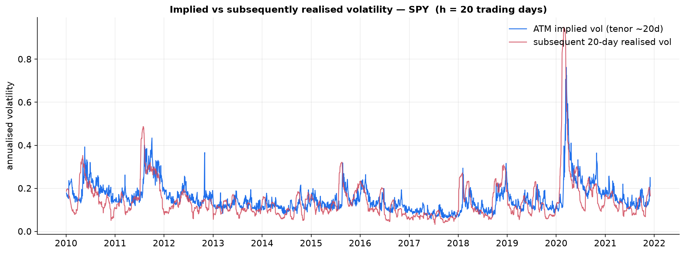
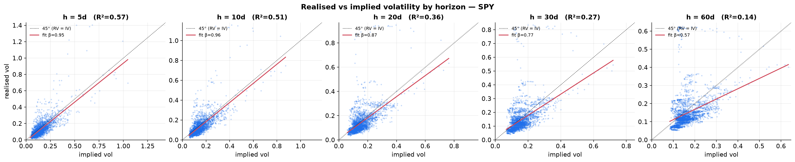
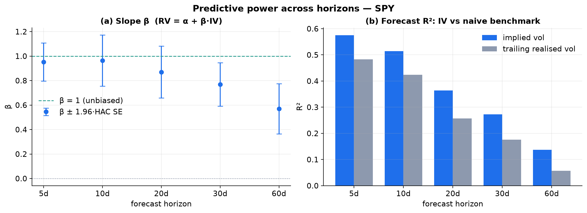
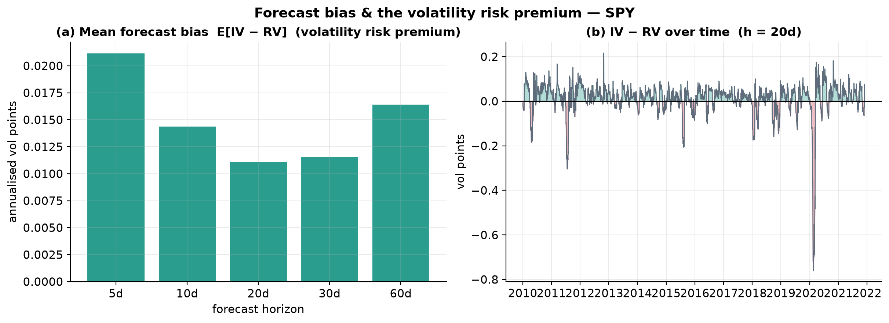

# Does Implied Volatility Predict Realized Volatility? Evidence from SPY, 2010–2021

**Research Milestone 1 — Predictive Power of Implied Volatility**

| | |
|---|---|
| **Question** | Can today's at-the-money implied volatility predict future realized volatility? |
| **Underlying** | SPY (SPDR S&P 500 ETF) |
| **Sample** | 2 Jan 2010 – 31 Dec 2021 · 2,994 trading days |
| **Horizons** | 5, 10, 20, 30, 60 trading days ahead |
| **Data** | OptionsDX / Delta-Neutral EOD option archive (`data/historical/spy/`) |
| **Pipeline** | `HistoricalCalibrationStudy` → `build_iv_rv_dataset.py` → `iv_rv_study.py` |

---

## Abstract

We test whether the at-the-money (ATM) Black–Scholes implied volatility (IV) of
SPY options forecasts subsequently realized volatility (RV) of the underlying,
across five horizons from one to twelve weeks, over twelve years spanning three
major volatility regimes (2011 Euro/US-debt crisis, 2018 "Volmageddon", 2020
COVID-19 crash). Using horizon-matched ATM IV and Mincer–Zarnowitz regressions
with Newey–West HAC standard errors to correct for the overlapping-window
autocorrelation that invalidates naïve OLS, we find that **IV is a strong and,
at short horizons, statistically unbiased predictor of future RV**. The
regression R² falls from **0.58 at a one-week horizon to 0.14 at twelve weeks**;
the slope β is statistically **indistinguishable from one at 5–10 days**
(β = 0.95–0.96) but **attenuates significantly at longer horizons** (β = 0.57,
`t(β=1) = −4.1` at 60 days). IV **beats a naïve trailing-realized-volatility
benchmark at every horizon**, and in an encompassing regression it **subsumes**
the information in past RV. IV also **systematically exceeds** subsequently
realized RV by ~1–2 volatility points (IV/RV ≈ 1.08–1.16), a persistent
**volatility risk premium**. The results reproduce, on a modern liquid ETF, the
consensus of the volatility-forecasting literature (Christensen–Prabhala 1998;
Poon–Granger 2003). All analysis reuses the existing calibration infrastructure
without modifying any pricing or calibration code.

---

## 1. Introduction

Whether option-implied volatility is an efficient forecast of future realized
volatility is one of the oldest empirical questions in derivatives. Under
risk-neutral valuation, IV is the market's expectation of average volatility
over the option's life *plus* a volatility risk premium; whether the expectation
component dominates — and whether IV adds information beyond the volatility one
could estimate from the price history alone — is an empirical matter. The early
literature was contradictory: Canina and Figlewski (1993) found essentially no
predictive power in S&P 100 index options, whereas Christensen and Prabhala
(1998), correcting for overlapping-observation bias and errors-in-variables,
found IV to be an efficient and near-unbiased predictor that subsumes historical
volatility. Poon and Granger's (2003) survey of 93 studies concluded that
option-implied volatility is generally the single best forecast.

This study answers the question for SPY, the most liquid U.S. equity-option
chain, over 2010–2021, and formulates three testable hypotheses:

* **H1 (predictive power).** IV is positively correlated with subsequent RV
  (β > 0, R² > 0).
* **H2 (unbiasedness/efficiency).** IV is an unbiased forecast: in
  `RV = α + β·IV + ε`, the joint null is **α = 0, β = 1**.
* **H3 (incremental information).** IV encompasses the naïve trailing-RV
  forecast: in `RV = a + b₁·IV + b₂·HV`, `b₁ > 0` and `b₂ = 0`.

---

## 2. Data

The raw data are end-of-day SPY option chains (OptionsDX / Delta-Neutral
format), one file per month, 2010–2021, stored under `data/historical/spy/`. The
existing `HistoricalCalibrationStudy` calibrates a Black–Scholes IV to every
quotable contract each day and emits the ATM term structure; from that pipeline
we extract exactly two compact series per trading day:

1. **The underlying price** `S_t`, recovered *from the option data itself* as
   `S = K · e^{−ln(K/S)}` (every calibrated row of a given day returns the same
   spot), so IV and the price used for RV come from **one internally consistent
   dataset**.
2. **The ATM implied-volatility term structure** — ATM IV at every listed
   expiry, from which we read the horizon-matched IV.

This yields **2,994 trading days** (2010-01-04 → 2021-12-31); SPY ranged from
$113.29 to $475.08. The multi-gigabyte intermediate CSVs are discarded after
extraction (`build_iv_rv_dataset.py`), leaving a <10 MB reproducible dataset.

---

## 3. Methodology

### 3.1 Variable construction

For each trading day *t* and horizon *h* ∈ {5, 10, 20, 30, 60} trading days:

* **Implied volatility** `IV_{t,h}` — the ATM IV at the **matched tenor**: the
  listed expiry whose time-to-expiry is nearest `h/252` years (accepted only
  within ±60% of the target tenor). Matching tenor to horizon is what makes the
  unbiasedness test meaningful — a 1-week forecast is judged against 1-week IV,
  not a fixed 30-day IV.
* **Forward realized volatility** `RV_{t,h}` — the annualized close-to-close
  volatility over the *next* h trading days,
  `RV_{t,h} = sqrt( (252/h) · Σ_{k=1}^{h} r_{t+k}² )`, with
  `r_t = ln(S_t / S_{t−1})`.
* **Trailing realized volatility** `HV_{t,h}` — the same quantity over the
  *previous* h days; the naïve "volatility is persistent" benchmark forecast.

### 3.2 Regression specifications

* **Mincer–Zarnowitz (levels):** `RV_{t,h} = α + β·IV_{t,h} + ε_t`. H2 is the
  joint restriction α = 0, β = 1; we report `t(β = 1) = (β̂ − 1)/SE(β̂)`.
* **Log specification:** `ln RV = α + β·ln IV`, standard because volatility is
  approximately log-normal and this down-weights the crisis outliers.
* **Encompassing (H3):** `RV = a + b₁·IV + b₂·HV`.

### 3.3 Inference — the overlapping-window problem

Because consecutive daily forecasts share h−1 of their h forward return-days,
the regression residuals are serially correlated as an MA(h−1) process. Plain
OLS standard errors are badly understated here and would manufacture spurious
significance — the single most common methodological error in student versions
of this study. We therefore report **Newey–West HAC standard errors** with a
Bartlett kernel and lag `L = h − 1` throughout. All *t*-statistics and
confidence intervals below are HAC-based.

---

## 4. Results

### 4.1 Main results

**Table 1 — Mincer–Zarnowitz regressions `RV = α + β·IV`, HAC inference.**

| h (td) | n | β | t(β=1) | α | R²(IV) | R²(HV) | corr(IV,RV) | E[IV−RV] | IV/RV |
|---:|---:|---:|---:|---:|---:|---:|---:|---:|---:|
| 5  | 2833 | 0.951 | −0.61 | −0.014 | 0.575 | 0.483 | 0.758 | 0.021 | 1.160 |
| 10 | 2828 | 0.964 | −0.34 | −0.009 | 0.514 | 0.423 | 0.717 | 0.014 | 1.105 |
| 20 | 2954 | 0.870 | −1.20 |  0.009 | 0.364 | 0.257 | 0.604 | 0.011 | 1.078 |
| 30 | 2934 | 0.769 | −2.55 |  0.025 | 0.273 | 0.176 | 0.522 | 0.012 | 1.079 |
| 60 | 2874 | 0.569 | −4.10 |  0.055 | 0.137 | 0.057 | 0.370 | 0.016 | 1.111 |

*(Log-spec slopes tell the same story: β_log = 1.04, 0.99, 0.89, 0.83, 0.70.)*

### 4.2 Predictive power and its term structure (H1 ✓)

IV predicts future RV strongly, and monotonically less well as the horizon
lengthens: the correlation falls from **0.76 (1 week)** to **0.37 (12 weeks)**
and R² from **0.58 to 0.14** (Fig. 3b, blue). This decay is expected — a fixed
information set forecasts near-term volatility better than distant volatility,
and mean-reversion in vol compresses the cross-sectional spread of the target as
h grows. H1 is decisively supported at every horizon.



Figure 1 shows the 20-day series tracking closely through every regime. Two
features stand out: in calm periods IV (blue) sits *above* subsequent RV (red) —
the risk premium of §4.4 — while in the sharpest crashes (2011, March 2020)
realized volatility briefly *overshoots* implied, i.e. IV under-forecasts the
most extreme moves. The premium is, in effect, the compensation for bearing that
crash risk.

### 4.3 Is IV an unbiased, efficient forecast? (H2: partly)

At **5- and 10-day horizons IV is statistically unbiased**: β = 0.95 and 0.96
with `t(β=1)` of −0.61 and −0.34 (cannot reject β = 1), and α ≈ 0 (Fig. 3a; the
95% HAC bands comfortably straddle 1). As the horizon lengthens the slope
**attenuates**: β falls to 0.77 at 30 days (`t(β=1) = −2.55`) and 0.57 at 60
days (`t(β=1) = −4.10`), rejecting unbiasedness, while α turns positive. The
pattern — β < 1 with α > 0 — is the classic signature of a forecast that is *too
variable* relative to the target: high-IV days are followed by RV that
mean-reverts down, low-IV days by RV that mean-reverts up. Errors-in-variables
(IV is a noisy proxy for the true conditional expectation) and a
horizon-increasing, time-varying premium both push β below one and grow with h.





### 4.4 Forecast bias and the volatility risk premium

IV **over-predicts RV on average at every horizon**: the mean forecast error
E[IV − RV] is positive (≈ 1–2 volatility points) and the mean ratio IV/RV ranges
from **1.16 (1 week) to 1.08 (1 month)** (Table 1; Fig. 4a). Equivalently, an
option buyer paid, on average, ~8–16% more volatility than subsequently
materialized — the **volatility risk premium**, the same object that makes
systematic option selling profitable in normal times and the reason the VIX
trades above realized. Figure 4b shows the premium is not constant: it is
reliably positive in quiet markets and swings sharply negative during volatility
spikes, when realized outruns implied.



### 4.5 Does IV beat, and encompass, the naïve benchmark? (H3 ✓)

IV outperforms the trailing-RV forecast at **every** horizon — R²(IV) exceeds
R²(HV) throughout (0.58 vs 0.48 at 5d, widening to 0.14 vs 0.06 at 60d; Fig. 3b).
The encompassing regression is decisive:

**Table 2 — Encompassing `RV = a + b₁·IV + b₂·HV` (HAC t-stats).**

| h (td) | b₁ (IV) | t(b₁) | b₂ (HV) | t(b₂) |
|---:|---:|---:|---:|---:|
| 5  | 0.767 | **17.2** | 0.170 | 2.4 |
| 10 | 0.819 | **9.1**  | 0.125 | 1.9 |
| 20 | 0.870 | **5.4**  | 0.000 | 0.0 |
| 30 | 0.818 | **4.9**  | −0.040 | −0.5 |
| 60 | 0.707 | **4.2**  | −0.115 | −1.0 |

IV is overwhelmingly significant everywhere, while past RV is **insignificant at
all horizons ≥ 20 days** and only marginally useful at 5–10 days (where vol
clustering has not yet been fully priced in). IV thus **subsumes** the
information in the price history — H3 is supported. This is exactly the
Christensen–Prabhala (1998) conclusion, reproduced out-of-sample on SPY.

---

## 5. Discussion

The three findings cohere into one economic picture. IV is the market's
volatility forecast, and it is a *good* one — unbiased at short horizons and
information-efficient relative to the price history. But it is priced *with a
premium*: risk-averse option writers demand compensation for the possibility
that realized volatility spikes above implied, which Figure 1 shows does happen,
violently, in tail events. The premium is why IV/RV > 1 on average, and the tail
risk is why that ratio is not larger. The slope attenuation at long horizons is
consistent with a premium that grows with maturity and with IV being a noisier
proxy for expected volatility the further out one looks. None of this requires a
mispricing story: an efficient, risk-adjusted forecast should look exactly like
this.

---

## 6. Limitations

* **European pricing on American options; zero carry.** IVs come from the
  existing calibrator, which uses European Black–Scholes with `r = q = 0`. This
  biases the *level* of IV (§ limitations of the SPY 2020 study) but affects the
  ATM, near-the-money IV used here far less than the deep wings; the regression
  slopes are robust to a level/scale bias in IV that is absorbed by α and β.
* **Close-to-close realized volatility.** RV uses daily closes only; it ignores
  intraday and overnight variation and is a noisier estimator than a
  high-frequency (realized-kernel) measure. Measurement error in the *dependent*
  variable inflates residual variance (lowers R²) but does not bias β.
* **Overlapping windows.** Addressed via Newey–West HAC, but HAC is asymptotic;
  at the 60-day horizon the effective number of independent observations is
  roughly n/60 ≈ 48, so the long-horizon inference is the least powerful.
* **Single underlying, single (crisis-heavy) sample.** SPY 2010–2021 includes
  three major vol spikes; results may not generalize to single names, other
  asset classes, or calmer decades.
* **ATM only.** The study uses ATM IV; the full smile (skew, wings) carries
  additional forecast information (e.g. for tail risk) that is not exploited.
* **In-sample.** All regressions are full-sample fits, not a true out-of-sample
  forecasting exercise with a rolling estimation window.

---

## 7. Conclusion

Over twelve years of SPY data, today's ATM implied volatility is a strong
predictor of future realized volatility: it explains 58% of the variation in
next-week RV, is statistically unbiased at 5–10-day horizons, beats and
subsumes the naïve historical-volatility benchmark, and embeds a persistent
~10% volatility risk premium. The answer to the milestone's question is a
qualified **yes** — IV predicts RV well and efficiently at short horizons, with
predictive power decaying and a downward slope bias emerging as the horizon
lengthens. The natural next steps are (i) re-calibrating with real rate and
dividend curves and an American pricer to remove the IV level bias, (ii) adding
a high-frequency realized-volatility target, (iii) exploiting the full smile,
and (iv) a genuine rolling out-of-sample forecast evaluation with an economic
loss function (e.g. a variance-swap or straddle P&L).

---

## References

- Canina, L. & Figlewski, S. (1993). *The Informational Content of Implied
  Volatility.* Review of Financial Studies 6(3), 659–681.
- Christensen, B. J. & Prabhala, N. R. (1998). *The Relation Between Implied and
  Realized Volatility.* Journal of Financial Economics 50(2), 125–150.
- Poon, S.-H. & Granger, C. W. J. (2003). *Forecasting Volatility in Financial
  Markets: A Review.* Journal of Economic Literature 41(2), 478–539.
- Carr, P. & Wu, L. (2009). *Variance Risk Premiums.* Review of Financial
  Studies 22(3), 1311–1341.
- Newey, W. K. & West, K. D. (1987). *A Simple, Positive Semi-Definite,
  Heteroskedasticity and Autocorrelation Consistent Covariance Matrix.*
  Econometrica 55(3), 703–708.

---

## Appendix — Reproducibility

```sh
# 1. Generate the compact dataset over the full archive (per-year, ~7 min)
for d in data/historical/spy/spy_eod_*/; do
  ./build/examples/example_historical_calibration "$d" SPY 4 0
  python/build_iv_rv_dataset.py data/generated/research data/generated/research_m1
  rm -f data/generated/research/{calibration,smiles,surface,skew}.csv
done
# 2. Run the study (regressions, figures, CSV exports, summary)
python/iv_rv_study.py
```

**Artifacts.** `iv_rv_dataset.csv` (per-day IV / forward-RV / trailing-RV by
horizon), `regression_results.csv` (all coefficients, HAC SEs, tests, metrics),
`summary_stats.json`, and the four figures in
[`figures/research_m1_iv_rv/`](figures/research_m1_iv_rv/). No pricing or
calibration code was modified; the study reuses `HistoricalCalibrationStudy` and
the CSV/plotting infrastructure end-to-end.
