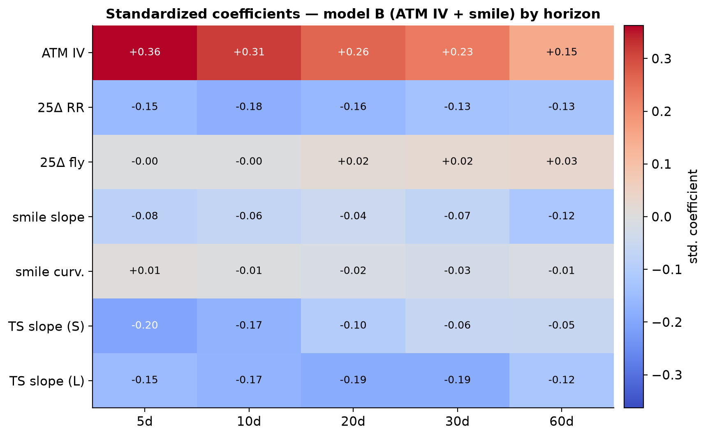
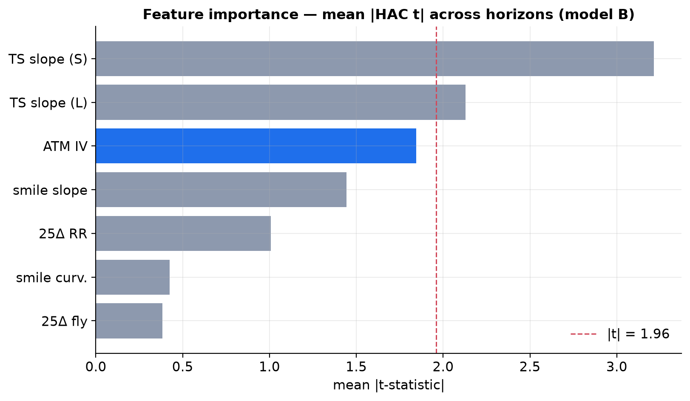
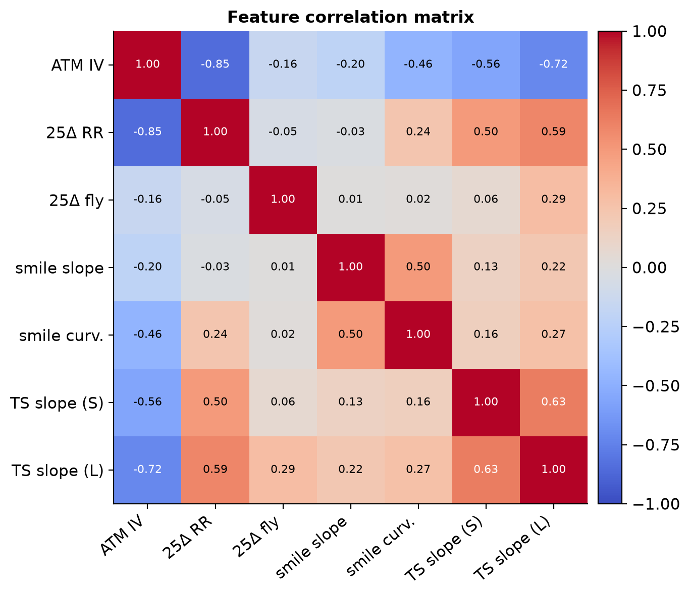
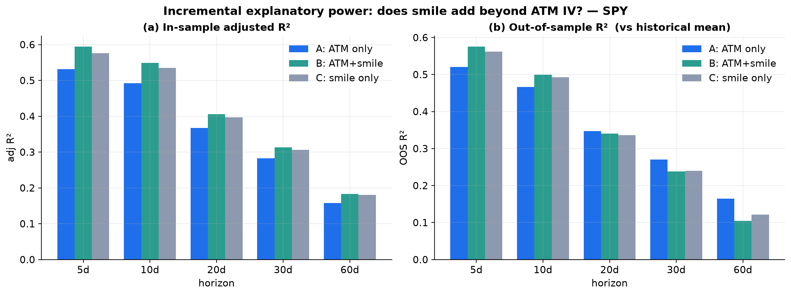
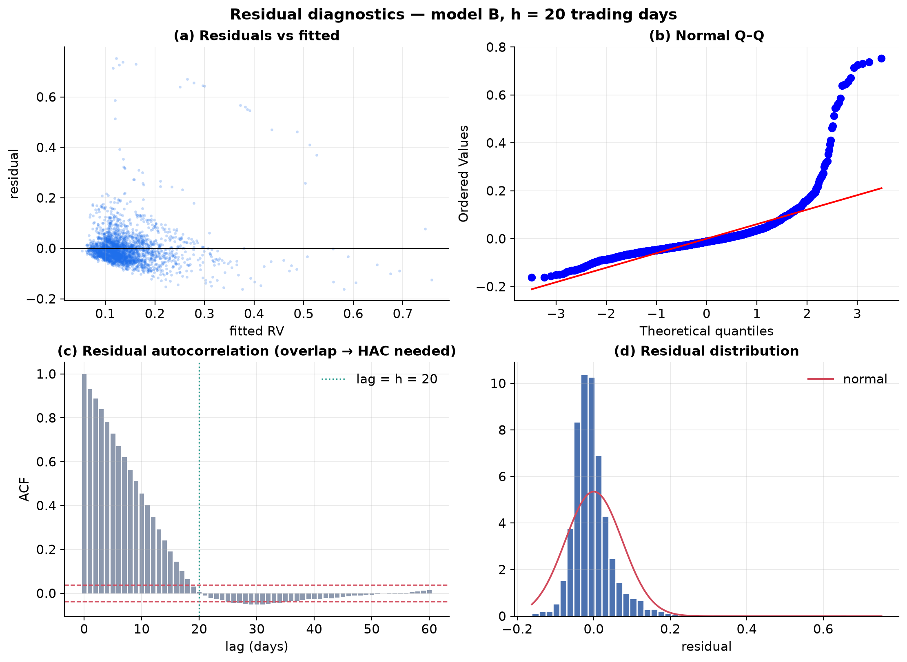

# Does the Volatility Smile Forecast Realized Volatility Beyond ATM Implied Vol? Evidence from SPY, 2010–2021

**Research Milestone 2 — Incremental Forecasting Power of the Volatility Surface**

| | |
|---|---|
| **Question** | Do smile-shape features (skew, curvature, term-structure slope) forecast future realized volatility *beyond* the ATM implied-vol level? |
| **Underlying** | SPY (SPDR S&P 500 ETF) |
| **Sample** | 2 Jan 2010 – 31 Dec 2021 · ~2,900 trading days per horizon |
| **Horizons** | 5, 10, 20, 30, 60 trading days ahead |
| **Design** | Nested regressions A (ATM only) ⊂ B (ATM + smile) ⊃ C (smile only), in- and out-of-sample |
| **Pipeline** | `HistoricalCalibrationStudy` → `build_m2_features.py` → `iv_smile_forecast_study.py` |

---

## Abstract

Milestone 1 established that ATM implied volatility (IV) is a strong predictor
of subsequent realized volatility (RV) for SPY. This milestone asks whether the
*shape* of the volatility surface — 25-delta risk reversal and butterfly, smile
slope and curvature, and the short- and long-end term-structure slopes — adds
forecasting power beyond the ATM *level*. Using nested forecasting regressions
with Newey–West HAC inference, incremental F- and HAC-robust Wald tests,
variance-inflation-factor diagnostics, and expanding-window out-of-sample (OOS)
evaluation, we find a sharply two-sided answer. **In-sample, smile features are
jointly and highly statistically significant at every horizon** — the
incremental F-tests and, more importantly, the HAC-robust Wald tests (which
survive the overlapping-window autocorrelation) reject the no-smile null with
p-values from 9×10⁻¹⁴ to 10⁻³. **But their economic and out-of-sample value is
modest and horizon-dependent.** The adjusted-R² gain from adding six smile
features is only 2.6–6.3 points and shrinks with horizon, and out-of-sample the
richer model **beats the parsimonious ATM-only model only at 5–10-day horizons
(+3–5 pts OOS R²) and *underperforms* it at 20–60 days (down to −6 pts)** — a
textbook overfitting result driven by feature multicollinearity (ATM IV and
25Δ RR correlate −0.85; VIFs of 7.3 and 5.3). The single most valuable
incremental feature is the **short-term term-structure slope** (front-end
inversion), not the skew: 25Δ risk reversal is never individually significant in
the joint model because it is largely redundant with the ATM level through the
leverage effect. The study reuses the existing calibration and analytics
infrastructure end-to-end and introduces no new pricing models or machine
learning.

---

## 1. Introduction

A large literature treats ATM implied volatility as *the* volatility forecast.
Yet the option market prices a whole surface, and its shape is informative about
the *distribution* of future returns, not just its scale: the skew (risk
reversal) prices downside/jump risk, the butterfly prices tail convexity, and
the term-structure slope encodes the market's view of how volatility will evolve.
If any of this shape information forecasts realized volatility beyond the ATM
level, a level-only model is inefficient. This milestone tests that hypothesis
directly and, crucially, distinguishes **statistical** significance (does smile
add signal in-sample?) from **economic / out-of-sample** significance (does it
improve a real forecast?). The two can, and here do, diverge.

**Hypotheses.**

* **H1 (in-sample).** Smile features are jointly significant beyond ATM IV: in
  `RV = α + β·IV + γ′·smile`, the restriction γ = 0 is rejected.
* **H2 (out-of-sample).** Adding smile features improves the out-of-sample
  forecast R² relative to the ATM-only model.
* **H3 (redundancy).** Because surface features are driven by common factors
  (the leverage effect ties skew to the level), they are multicollinear and
  individually fragile.

---

## 2. Data and features

The realized-volatility target and the daily underlying price are reused from
Milestone 1 (SPY, 2010–2021, spot recovered from the option data). The smile
features are extracted at a **~1-month reference tenor** from the existing
`HistoricalCalibrationStudy` outputs — reusing the C++ `volatility_analytics`
directly rather than recomputing anything:

| Feature | Source | Definition |
|---|---|---|
| `atm_iv` | `skew.csv` | ATM implied vol, ~30-day expiry |
| `rr25` | `skew.csv` | 25Δ risk reversal = σ(25Δ call) − σ(25Δ put) |
| `bf25` | `skew.csv` | 25Δ butterfly = ½(σ(25Δc)+σ(25Δp)) − σ(ATM) |
| `slope` | `smiles.csv` | dσ/dm at m=0 from a quadratic fit, m = ln(K/S) |
| `curvature` | `smiles.csv` | d²σ/dm² from the same quadratic fit |
| `ts_slope_short` | `term_structure.csv` | σ(30d) − σ(7d) |
| `ts_slope_long` | `term_structure.csv` | σ(90d) − σ(30d) |

The **forward realized volatility** `RV_{t,h} = sqrt((252/h)·Σ_{k=1}^{h} r_{t+k}²)`
is the same annualized close-to-close estimator as Milestone 1.

## 3. Methodology

**Nested models**, estimated separately at each horizon *h*:

* **A (ATM only):** `RV = α + β·atm_iv`
* **B (ATM + smile):** `RV = α + β·atm_iv + γ′·(rr25, bf25, slope, curvature, ts_slope_short, ts_slope_long)`
* **C (smile only):** `RV = α + γ′·(the six shape features)`

**Inference.** All in-sample standard errors are Newey–West HAC (Bartlett
kernel, lag `h−1`) to handle the MA(h−1) residual autocorrelation induced by
overlapping forecast windows. We test H1 two ways: the classical **incremental
F-test** (B vs A) and a **HAC-robust Wald test** on the six smile coefficients —
the latter is authoritative, since the classical F assumes iid errors that the
overlap violates. **Multicollinearity** is quantified with variance inflation
factors (VIF_j = 1/(1−R²_j)) and the feature correlation matrix. **Out-of-sample
R²** uses an expanding window (≥2-year burn-in) against the historical-mean
benchmark, with a strict look-ahead guard: a forecast made at day *t* is trained
only on observations whose h-day target window had already closed by *t*.

---

## 4. Results

### 4.1 Main results

**Table 1 — In-sample fit, joint tests, and out-of-sample R².**

| h (td) | adj R² (A) | adj R² (B) | adj R² (C) | incr. F | F p-value | **HAC Wald p** | OOS R² (A) | OOS R² (B) | OOS R² (C) |
|---:|---:|---:|---:|---:|---:|---:|---:|---:|---:|
| 5  | 0.531 | 0.594 | 0.576 | 73.0 | 9×10⁻⁸⁵ | **9×10⁻¹⁴** | 0.521 | **0.575** | 0.562 |
| 10 | 0.492 | 0.549 | 0.535 | 59.3 | 3×10⁻⁶⁹ | **2×10⁻⁵**  | 0.466 | **0.499** | 0.492 |
| 20 | 0.367 | 0.406 | 0.397 | 31.1 | 2×10⁻³⁶ | **1×10⁻³**  | **0.347** | 0.341 | 0.336 |
| 30 | 0.283 | 0.313 | 0.306 | 21.5 | 8×10⁻²⁵ | **4×10⁻³**  | **0.270** | 0.239 | 0.240 |
| 60 | 0.158 | 0.183 | 0.180 | 15.2 | 3×10⁻¹⁷ | **9×10⁻⁴**  | **0.165** | 0.105 | 0.121 |

### 4.2 In-sample: smile is statistically significant everywhere (H1 ✓)

Adding the six smile features raises adjusted R² at every horizon, and the joint
null γ = 0 is decisively rejected — not only by the classical incremental F
(F = 15–73) but, importantly, by the **HAC-robust Wald test** (p ≤ 10⁻³ at all
horizons), which is immune to the overlap-induced autocorrelation that would
otherwise inflate significance. So the surface shape genuinely carries
volatility-forecasting signal beyond the ATM level. **H1 is supported.**

*Which* features carry it is more revealing (Fig. 1, Fig. 2; Table 2). The
**short-term term-structure slope is by far the strongest incremental
predictor** — HAC t = −6.5 at 5 days, still −2.3 at 20 days — followed by the
long-end slope. Their negative sign means an *inverted* front end (short-dated
vol elevated above one-month vol) forecasts *higher* subsequent RV, the natural
stress signal. Smile slope contributes at short horizons; **25Δ risk reversal,
butterfly, and curvature are individually insignificant in the joint model.**
Strikingly, the ATM level's *own* marginal t-statistic falls below 2 beyond the
1-week horizon — a direct symptom of the collinearity documented next.

**Table 2 — Model-B HAC t-statistics by feature and horizon.** (|t|>1.96 bold.)

| feature | 5d | 10d | 20d | 30d | 60d |
|---|---:|---:|---:|---:|---:|
| ATM IV          | **3.99** | **2.20** | 1.41 | 1.05 | 0.57 |
| 25Δ RR          | −1.50 | −1.18 | −0.95 | −0.75 | −0.66 |
| 25Δ butterfly   | −0.10 | −0.10 | 0.46 | 0.62 | 0.64 |
| smile slope     | **−2.75** | −1.59 | −0.90 | −1.02 | −0.96 |
| smile curvature | 0.31 | −0.24 | −0.69 | −0.66 | −0.22 |
| **TS slope (short)** | **−6.48** | **−4.20** | **−2.34** | −1.58 | −1.47 |
| TS slope (long) | **−3.47** | **−2.67** | −1.87 | −1.50 | −1.14 |





### 4.3 Multicollinearity and redundancy (H3 ✓)

The features are far from independent (Fig. 3). **ATM IV and 25Δ RR correlate
−0.85**: when volatility rises, the skew steepens (the leverage effect
documented in Milestone 1), so the risk reversal is largely a *restatement* of
the level. ATM IV also correlates −0.72 with the long-end term-structure slope
and −0.56 with the short-end slope (high vol ⇒ inverted term structure). The
resulting variance-inflation factors — **ATM IV 7.3, 25Δ RR 5.3**, others ≤ 2.7
— confirm that the level and the skew fight over the same variance. This is
exactly why (i) 25Δ RR is individually insignificant despite skew being
economically real, (ii) the ATM coefficient itself becomes unstable at long
horizons, and (iii) the **"smile-only" model C nearly matches the full model B**
(Table 1): the shape features, through the leverage effect, already encode most
of the level. The 25Δ butterfly is the most orthogonal feature (|corr| ≤ 0.29
with everything) but also the least informative. **H3 is supported.**



### 4.4 Out-of-sample: parsimony wins at longer horizons (H2 ✗ beyond 2 weeks)

The economic verdict is delivered out-of-sample (Fig. 4b). Adding smile features
**improves** OOS R² at the 5- and 10-day horizons (+5.4 and +3.2 points) but
**degrades** it at 20, 30, and 60 days (−0.6, −3.2, and −6.0 points). The
crossover sits around two to three weeks. In-sample significance does not
survive as out-of-sample value at longer horizons: the extra parameters, fit on
collinear regressors, chase in-sample noise and generalize worse than the
one-parameter ATM model. This is the classic Welch–Goyal lesson — a model can be
"significant" and still forecast worse — and it is why we insist on OOS
evaluation rather than stopping at the F-test. **H2 holds only at short
horizons.**



### 4.5 Residual diagnostics

Figure 5 (model B, h = 20) validates the inference machinery: residuals are
mean-zero and roughly homoskedastic in the fitted value, heavier-tailed than
normal in the Q–Q plot (as expected for volatility data with crisis
observations), and — most importantly — the residual autocorrelation function
is large out to ≈ h lags, the precise overlap-induced dependence that makes
plain OLS standard errors invalid and mandates the HAC/Wald inference used
throughout.



---

## 5. Discussion

The two-sided result is the point. The volatility surface's *shape* does carry
statistically robust incremental information about future realized volatility —
but concentrated in the **term-structure slope**, especially the short end,
rather than the skew or convexity that first come to mind. The skew (risk
reversal) *looks* like it should help, and in isolation it does, but in the
presence of the ATM level it is redundant: the leverage effect makes high vol
and steep skew two views of one state. Economically, the incremental content is
small and, out-of-sample, only usable at horizons up to two weeks; beyond that
the disciplined one-factor ATM forecast is superior. A practitioner should read
this as: *watch the front-end term-structure slope as an early-warning
complement to the VIX-style level at short horizons, but do not expect the smile
to improve a one-to-three-month volatility forecast.*

---

## 6. Limitations

* **Linear models only.** By design (no machine learning), we test *linear*
  incremental power; non-linear interactions of surface features are out of
  scope and could in principle recover value the linear model discards.
* **Fixed ~1-month feature tenor.** Skew/curvature/slope are read at one
  reference tenor; a horizon-matched smile might carry more targeted
  information, at the cost of the clean nested design.
* **European-BS, zero-carry IVs.** As in Milestone 1, IVs come from the existing
  European calibrator with `r = q = 0`; this biases IV *levels* but is largely
  absorbed by the regression intercept/slope and affects the *shape* features
  less.
* **Collinearity limits attribution.** With VIFs up to 7, individual coefficient
  signs (e.g. the ATM level's fading t-stat) must be read jointly, not
  feature-by-feature.
* **Single underlying, in-sample feature set.** Results are for SPY and one
  reference-tenor feature construction; other indices, single names, or
  richer/High-frequency RV targets may differ.

---

## 7. Conclusion

Over twelve years of SPY, volatility-smile features provide **statistically
significant but economically limited** forecasting power beyond ATM implied
volatility. In-sample they are jointly significant at every horizon under
rigorous HAC inference; out-of-sample they help only at short (≤ 2-week)
horizons and hurt at longer ones, where the parsimonious ATM-IV model wins. The
useful signal lives mainly in the **short-term term-structure slope**, while the
25-delta skew is largely redundant with the ATM level through the leverage
effect. The overarching methodological lesson — that in-sample significance is
not out-of-sample value — is as much a result as the finance. Natural
extensions (still within the "no ML, no new pricing" mandate): horizon-matched
smile features, orthogonalized/principal-component surface factors to break the
collinearity, and an economic-loss (variance-swap or straddle P&L) evaluation of
whether the short-horizon OOS gain is monetizable.

---

## References

- Christensen, B. J. & Prabhala, N. R. (1998). *The Relation Between Implied and
  Realized Volatility.* Journal of Financial Economics 50(2), 125–150.
- Poon, S.-H. & Granger, C. W. J. (2003). *Forecasting Volatility in Financial
  Markets: A Review.* Journal of Economic Literature 41(2), 478–539.
- Welch, I. & Goyal, A. (2008). *A Comprehensive Look at the Empirical
  Performance of Equity Premium Prediction.* Review of Financial Studies 21(4),
  1455–1508. *(Out-of-sample discipline.)*
- Newey, W. K. & West, K. D. (1987). *A Simple, Positive Semi-Definite,
  Heteroskedasticity and Autocorrelation Consistent Covariance Matrix.*
  Econometrica 55(3), 703–708.
- Campbell, J. Y. & Thompson, S. B. (2008). *Predicting Excess Stock Returns Out
  of Sample.* Review of Financial Studies 21(4), 1509–1531. *(OOS R².)*

---

## Appendix — Reproducibility

```sh
# 1. Extract the smile-shape features over the full archive (per-year, ~7 min)
for d in data/historical/spy/spy_eod_*/; do
  ./build/examples/example_historical_calibration "$d" SPY 4 0
  .venv/bin/python python/build_m2_features.py data/generated/research data/generated/research_m1
  rm -f data/generated/research/{calibration,smiles,surface,skew,term_structure}.csv
done
# 2. Run the nested forecasting study (regressions, OOS, VIF, figures, CSVs)
.venv/bin/python python/iv_smile_forecast_study.py
```

**Artifacts.** `m2_forecast_dataset.csv` (per-day features + forward RV by
horizon), `m2_regression_results.csv` (adj-R², tests, OOS R² per horizon/model),
`m2_vif.csv`, `m2_feature_correlation.csv`, `summary_stats.json`, and the five
figures in [`figures/research_m2_smile/`](figures/research_m2_smile/). No pricing
or calibration code was modified; the study reuses `HistoricalCalibrationStudy`,
the Milestone-1 realized-volatility construction, and the HAC-OLS estimator.
