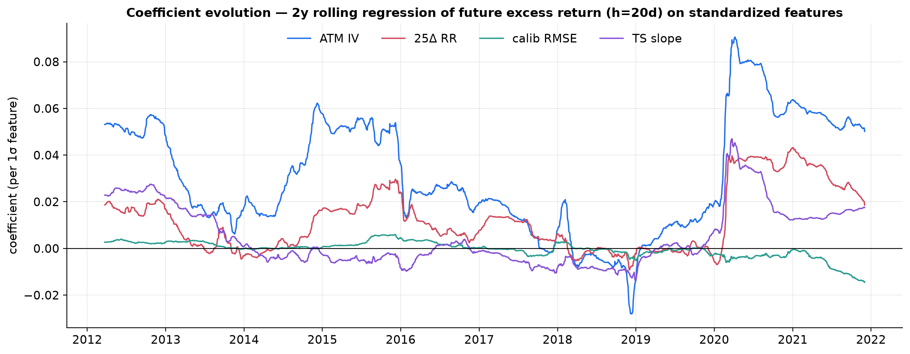
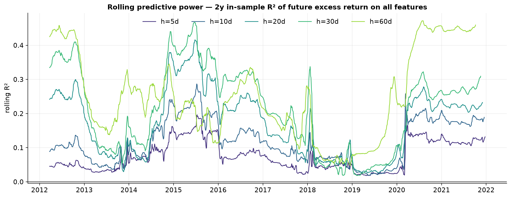
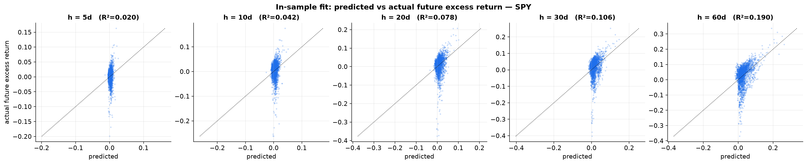
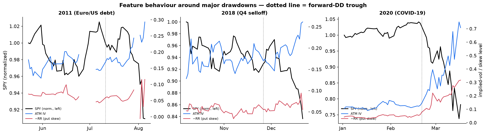
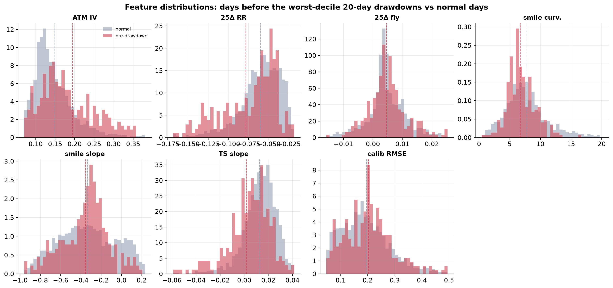

# Do Option Surfaces Predict SPY Returns? Evidence, and Its Fragility, 2010–2021

**Research Milestone 3 — Option-Implied Information and Equity Return Predictability**

| | |
|---|---|
| **Question** | Do option-surface features predict future SPY *returns* (not volatility)? |
| **Underlying** | SPY (SPDR S&P 500 ETF) |
| **Sample** | 2 Jan 2010 – 31 Dec 2021 · ~2,900 trading days per horizon |
| **Horizons** | 5, 10, 20, 30, 60 trading days ahead |
| **Targets** | future log return, excess return, downside return, forward drawdown |
| **Predictors** | ATM IV, 25Δ risk reversal, 25Δ butterfly, smile curvature, smile slope, term-structure slope, calibration RMSE |
| **Pipeline** | `HistoricalCalibrationStudy` → `build_m3_calib.py` (+ M1/M2 masters) → `option_return_predictability.py` |

---

## Abstract

Milestones 1–2 showed that option-implied volatility forecasts future *realized
volatility* strongly and efficiently. This milestone asks the harder question:
do the same surfaces forecast future *returns*? Pairing each daily SPY surface
with subsequent returns over five horizons and regressing four return targets on
seven surface features with Newey–West HAC inference, rolling estimation, and
subperiod stability analysis, we reach a deliberately sceptical conclusion. **In
sample, the features appear to predict returns** — predictive R² rises with
horizon to 19% for 60-day returns and reaches 22% for near-term drawdowns, with
significant joint Wald tests — **but almost all of this apparent power is an
artifact or a restatement of volatility, not genuine return-direction
predictability.** Three findings support this. (i) The rising long-horizon R² is
the classic overlapping-return / persistent-predictor inflation (Boudoukh,
Richardson & Whitelaw 2008); the honest short-horizon return R² is only ~2%.
(ii) The relationship is **highly unstable**: the 2-year rolling R² swings from
~0.02 to ~0.47 and collapses to near zero in 2018–2019, and subperiod
coefficients flip signs (the term-structure-slope and calibration-RMSE t-stats
reverse from +2.2/+2.1 to −1.9/−2.1 across subperiods) — the signature of
fragile, regime-dependent, likely spurious predictability. (iii) The one
semi-robust signal is the **ATM implied-vol level**, which enters positively
(HAC t = 2.7 at the 20-day horizon), consistent with the risk-return / variance-
risk-premium channel (Bollerslev, Tauchen & Zhou 2009), while the surface
*shape* (skew, butterfly, curvature) contributes little. Drawdown "predictability"
is largely volatility predictability in disguise. Before the worst drawdowns
implied vol is elevated (+0.7σ) and put skew steeper (−0.6σ), but the
distributions overlap heavily and the features move *with*, not ahead of, the
selloffs. The study builds only on existing infrastructure and introduces no
trading strategy and no machine learning.

---

## 1. Introduction

Equity return predictability is among the most contested topics in finance.
Welch and Goyal (2008) showed that the standard predictors fail out of sample.
Yet option markets are forward-looking and price the full risk-neutral
distribution, so option-implied quantities are natural predictor candidates:
the variance risk premium predicts the equity premium (Bollerslev, Tauchen &
Zhou 2009), and risk-neutral skew predicts the cross-section of returns (Xing,
Zhang & Zhao 2010; Cremers & Weinbaum 2010; An, Ang, Bali & Cakici 2014). This
milestone brings the SPY option surface to bear on the *index's own* future
returns and — as importantly — stress-tests any apparent predictability for
stability, because in this literature the difference between a real signal and a
spurious one is everything.

**Targets** (over horizon *h*, from the underlying recovered in Milestone 1):
future log return `ln(S_{t+h}/S_t)`, excess return (net of a documented constant
risk-free proxy, ~identical under the ZIRP-heavy sample), downside return
`min(0, R)`, and the forward maximum drawdown over the window.

---

## 2. Data and method

Six predictors are reused directly from Milestones 1–2 (ATM IV, 25Δ RR, 25Δ
butterfly, smile slope/curvature, term-structure slope); the seventh —
**calibration RMSE**, the daily `|provider_iv − computed_iv|` fit error as a
proxy for surface dislocation — is extracted here (`build_m3_calib.py`) from the
existing `calibration.csv`. Features are standardized (z-scored) so coefficients
are comparable and expressed per one-standard-deviation move.

For each target and horizon we estimate `target = α + Σ βᵢ·featureᵢ` with
**Newey–West HAC** standard errors (lag `h−1`, for the overlapping-window
autocorrelation), and test joint significance with a HAC-robust Wald test. We
then probe robustness three ways the volatility studies did not need: a
**2-year rolling** regression (coefficient and R² evolution), a **three-subperiod
split** (2010–13 / 2014–17 / 2018–21), and event studies around the major
drawdowns.

---

## 3. Results

### 3.1 Apparent predictive power

**Table 1 — Predictive R² by target and horizon (joint Wald p in parentheses).**

| target | 5d | 10d | 20d | 30d | 60d |
|---|---|---|---|---|---|
| future log return | 2.0% (0.02) | 4.2% (0.00) | 7.8% (0.00) | 10.6% (0.00) | 19.0% (0.00) |
| future excess return | 2.0% (0.02) | 4.2% (0.00) | 7.8% (0.00) | 10.6% (0.00) | 19.0% (0.00) |
| downside return | 5.4% (0.00) | 3.7% (0.06) | 1.8% (0.25) | 2.2% (0.17) | 2.0% (0.18) |
| forward drawdown | 22.5% (0.00) | 22.0% (0.00) | 13.4% (0.00) | 8.7% (0.00) | 3.4% (0.03) |

Taken at face value this looks like strong return predictability. The rest of
this section explains why most of it is not what it appears.

### 3.2 The long-horizon R² is an overlap artifact

The central-return R² *rises* monotonically with horizon (2% → 19%). This is the
opposite of the volatility result (M1), where R² *fell* with horizon, and it is
the hallmark of the overlapping-return / persistent-predictor inflation
documented by Boudoukh, Richardson & Whitelaw (2008): when a persistent
regressor (ATM IV is highly autocorrelated) is regressed on overlapping
multi-period returns, R² grows roughly linearly in the horizon almost
mechanically, and even HAC inference does not fully purge the small-sample bias
(the Stambaugh 1999 problem). The economically honest number is the
**non-overlapping short-horizon R² of ~2%** — small.

### 3.3 The relationship is unstable (the decisive evidence)

Return predictability that is real should be reasonably stable. It is not.

* **Rolling R² (Fig. 2)** swings between ~0.02 and ~0.47 and **collapses to
  essentially zero across 2018–2019**, then spikes again in the 2020 crisis. The
  signal exists only in high-volatility regimes.
* **Subperiod coefficients flip sign (Table 2).** For 20-day excess returns, the
  term-structure-slope t-stat runs +2.2 → −1.9 → +1.2 across the three
  subperiods, and calibration RMSE runs +2.1 → +0.8 → −2.1. Which features are
  "significant" changes completely from period to period.
* **Coefficient paths (Fig. 1)** are non-stationary: only the ATM-IV coefficient
  keeps a consistent (positive) sign, and even its magnitude varies fivefold.

**Table 2 — Subperiod instability, 20-day excess return (HAC t-statistics).**

| period | n | R² | Wald p | ATM IV | 25Δ RR | 25Δ fly | curv. | slope | TS slope | calib RMSE |
|---|---:|---:|---:|---:|---:|---:|---:|---:|---:|---:|
| 2010–2013 | 935 | 5.2% | 0.02 | +1.7 | +0.2 | −1.7 | +1.1 | −0.1 | **+2.2** | **+2.1** |
| 2014–2017 | 992 | 11.8% | 0.00 | +1.2 | **+2.0** | +1.9 | +0.9 | −1.3 | **−1.9** | +0.8 |
| 2018–2021 | 982 | 17.5% | 0.00 | **+2.0** | +1.3 | +0.9 | −0.2 | +0.4 | +1.2 | **−2.1** |

This is the classic fragility that Welch & Goyal (2008) warned about: strong
in-sample fit, no stable structure.





### 3.4 What survives: the ATM-IV / risk-premium channel

In the full 20-day excess-return regression only the **ATM implied-vol level is
individually significant (HAC t = 2.7)**; risk reversal (1.1), butterfly (−0.2),
curvature (1.2), slope (−1.1), term-structure slope (1.5) and calibration RMSE
(0.0) are not. ATM IV enters **positively**: high implied vol predicts higher
subsequent returns. This is the level analog of the variance-risk-premium result
of Bollerslev, Tauchen & Zhou (2009) and the risk-return trade-off of French,
Schwert & Stambaugh (1987) — investors are compensated for bearing volatility.
It is the single economically interpretable, sign-stable finding, and it says
the *level* of the surface, not its *shape*, carries the (modest) return signal.



### 3.5 Drawdowns: volatility predictability in disguise

Forward drawdown is the "most predictable" target (R² = 22% at 5 days), but this
is misleading: maximum drawdown over a window is *mechanically* an increasing
function of volatility, so predicting drawdown from ATM IV is largely
re-predicting volatility (Milestone 1), not forecasting the direction of
returns. The declining R² with horizon (22% → 3%) mirrors the volatility result,
confirming the interpretation.

### 3.6 The pre-drawdown surface

Comparing the days preceding the worst-decile 20-day drawdowns to normal days
(Fig. 5), the pre-drawdown surface has **higher ATM IV (+0.7σ), steeper put skew
(RR −0.6σ), and a more inverted term structure (−0.6σ)**; butterfly, smile
slope, and calibration RMSE barely move. But two caveats gut any
crash-prediction reading: the distributions **overlap heavily** (a tilt in the
odds, not a separation), and these conditions are *contemporaneous* with high-
volatility regimes in which drawdowns already cluster. The event studies (Fig. 4)
make this concrete — in 2011, 2018-Q4, and 2020, ATM IV and put skew rise *as*
the selloff unfolds, not reliably before the forward-drawdown trough.





---

## 4. Discussion — relation to the literature

Our results sit squarely in the modern consensus. On **return predictability
scepticism**, the instability and near-zero calm-period R² echo Welch & Goyal
(2008); the inflated long-horizon R² is the Boudoukh–Richardson–Whitelaw (2008)
overlap artifact, compounded by the Stambaugh (1999) persistent-regressor bias.
On **option-implied information**, the one durable signal — a positive ATM-IV
coefficient — is the index-level counterpart of the variance-risk-premium return
predictability of Bollerslev, Tauchen & Zhou (2009) and the volatility risk-
return trade-off. Where the cross-sectional literature finds that **risk-neutral
skew** predicts single-name returns (Xing, Zhang & Zhao 2010; Cremers & Weinbaum
2010; An et al. 2014), we find the *index* risk reversal adds little beyond the
vol level once collinearity (Milestone 2: ATM–RR corr −0.85) and stability are
accounted for — consistent with skew's return signal being primarily a
cross-sectional, not index-timing, phenomenon. The overarching message is the
one that separates volatility from returns: **the option surface tells you a
great deal about future *risk* and very little, reliably, about future
*direction*** — as an efficient market should imply.

---

## 5. Limitations

* **In-sample and overlapping.** We report in-sample fits with HAC/rolling/
  subperiod robustness but no formal out-of-sample forecast; the honest verdict
  (fragility) makes a full OOS horse race a natural but secondary step.
* **Drawdown ≠ direction.** Forward drawdown and downside return are
  volatility-laden; they measure risk more than timing.
* **Excess-return proxy.** The risk-free leg uses a documented constant (~0.6%);
  under the ZIRP-heavy sample excess and raw returns are numerically identical,
  so no genuine excess-return conclusion should be over-read.
* **European-BS, zero-carry IVs; single index; linear models only** (per the
  no-ML mandate) — non-linearities and interactions are out of scope.
* **Persistent-regressor bias.** Coefficients on the most autocorrelated
  predictors (ATM IV) carry Stambaugh bias not fully removed by HAC.

---

## 6. Conclusion

Across twelve years of SPY, option-surface features do **not** provide robust,
stable forecasting power for future returns. The apparent in-sample
predictability is (i) inflated at long horizons by overlapping-return mechanics,
(ii) unstable across time and subperiods to the point of sign reversal, and
(iii) for drawdowns, largely a restatement of volatility predictability. The
only economically coherent, sign-stable signal is the positive effect of the
**ATM implied-vol level** on subsequent returns — the risk-return / variance-
premium channel — while the surface *shape* adds little. This completes a clean
arc across the three milestones: the option surface predicts future **volatility**
well (M1), its **shape** adds modest volatility information at short horizons
(M2), but it predicts future **returns** only weakly and unreliably (M3) — the
market is far more forecastable in its risk than in its direction. Consistent
with the mandate, we draw no trading strategy from this; the appropriate next
step is a formal out-of-sample and economic-significance evaluation of the sole
surviving (ATM-IV) channel, not a backtest of the fragile multi-feature fit.

---

## References

- Welch, I. & Goyal, A. (2008). *A Comprehensive Look at the Empirical
  Performance of Equity Premium Prediction.* Review of Financial Studies 21(4).
- Boudoukh, J., Richardson, M. & Whitelaw, R. (2008). *The Myth of Long-Horizon
  Predictability.* Review of Financial Studies 21(4).
- Stambaugh, R. F. (1999). *Predictive Regressions.* Journal of Financial
  Economics 54(3).
- Bollerslev, T., Tauchen, G. & Zhou, H. (2009). *Expected Stock Returns and
  Variance Risk Premia.* Review of Financial Studies 22(11).
- Xing, Y., Zhang, X. & Zhao, R. (2010). *What Does the Individual Option
  Volatility Smirk Tell Us About Future Equity Returns?* JFQA 45(3).
- Cremers, M. & Weinbaum, D. (2010). *Deviations from Put-Call Parity and Stock
  Return Predictability.* JFQA 45(2).
- An, B.-J., Ang, A., Bali, T. & Cakici, N. (2014). *The Joint Cross Section of
  Stocks and Options.* Journal of Finance 69(5).
- French, K., Schwert, G. W. & Stambaugh, R. (1987). *Expected Stock Returns and
  Volatility.* Journal of Financial Economics 19(1).

---

## Appendix — Reproducibility

```sh
# 1. Extract daily calibration RMSE over the full archive (per-year, ~7 min)
for d in data/historical/spy/spy_eod_*/; do
  ./build/examples/example_historical_calibration "$d" SPY 4 0
  .venv/bin/python python/build_m3_calib.py data/generated/research data/generated/research_m1
  rm -f data/generated/research/{calibration,smiles,surface,skew,term_structure}.csv
done
# 2. Run the return-predictability study (needs the M1/M2 masters)
.venv/bin/python python/option_return_predictability.py
```

**Artifacts.** `m3_return_dataset.csv` (features + four return targets by
horizon), `m3_regression_results.csv` (R², joint Wald p, HAC t per feature),
`summary_stats.json`, and the five figures in
[`figures/research_m3_returns/`](figures/research_m3_returns/). No pricing or
calibration code was modified; the study reuses `HistoricalCalibrationStudy`,
the M1/M2 feature masters, and the HAC-OLS estimator. No trading strategy or ML
was introduced.
