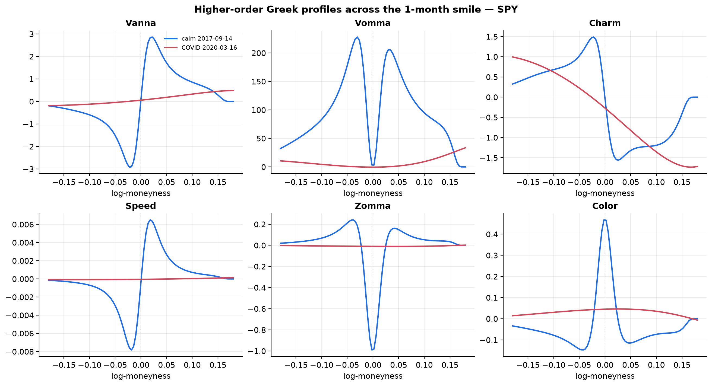
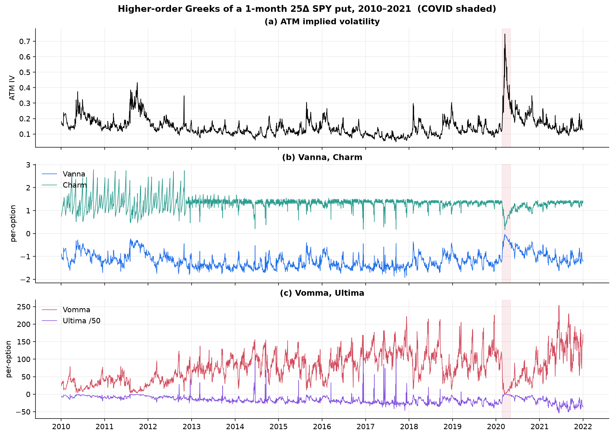
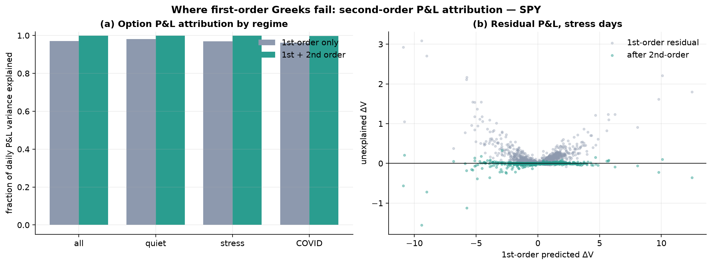
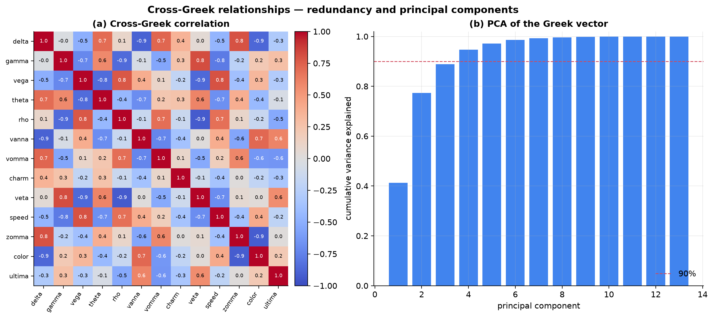
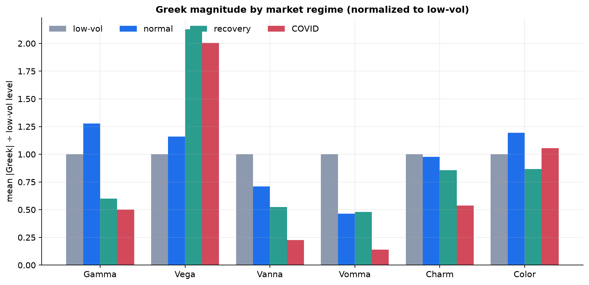
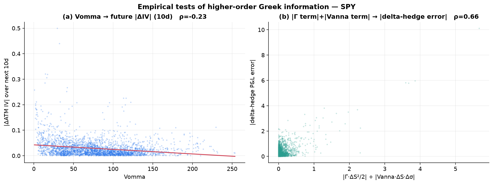

# Higher-Order Greeks and Dynamic Option Risk — A Survey with SPY Evidence, 2010–2021

**Research Milestone 4 — Second-Order and Mixed Sensitivities**

| | |
|---|---|
| **Objective** | Determine which higher-order Greeks actually explain option P&L, hedging error, and volatility dynamics — and which are primarily theoretical |
| **Underlying** | SPY · 2 Jan 2010 – 31 Dec 2021 · 2,994 trading days · 366k smile points |
| **Method** | Closed-form Greeks (validated vs finite differences to <5×10⁻⁵) computed on the historical calibrated surfaces; no change to the C++ pricing engine |
| **Code** | `higher_order_greeks.py`, `build_m4_greeks_panel.py`, `greeks_empirical_study.py` |

> **Scope note.** The C++ engine already computes first-order Greeks. This
> milestone adds *measurement only*: a validated Python module computes the
> higher-order sensitivities analytically and applies them to the existing
> calibrated surfaces. No pricing model was added or modified.

---

## Part I — Mathematical Survey

Every Greek is a partial derivative of one function, the Black–Scholes value
`V(S, σ, τ, r)` of an option on spot `S`, at volatility `σ`, maturity `τ` (years,
so calendar time `t` runs opposite: `∂/∂t = −∂/∂τ`), rate `r`, dividend yield
`q`. With

  `d₁ = [ln(S/K) + (r − q + σ²/2)τ] / (σ√τ)`,  `d₂ = d₁ − σ√τ`,
  `φ` = standard-normal pdf, `N` = cdf,

the Greeks are the entries of the Hessian (and beyond) of `V`. They are **not
isolated quantities**: they are the coefficients of the multivariate Taylor
expansion of `V` in `(S, σ, t)`, so taking one more derivative in `S` or `σ` or
`t` simply generates the next one. The higher-order Greeks are the second and
third such coefficients.

**Organising principle — the derivative lattice.** Writing `V_S = ∂V/∂S` etc.:

| | +∂/∂S | +∂/∂σ | +∂/∂t |
|---|---|---|---|
| **V** | Delta | Vega | Theta |
| **Delta** = V_S | Gamma | **Vanna** | **Charm** |
| **Vega** = V_σ | **Vanna** | **Vomma** | **Veta** |
| **Gamma** = V_SS | **Speed** | **Zomma** | **Color** |
| **Vomma** = V_σσ | **Zomma** | **Ultima** | — |

Every higher-order Greek is one step down-and-across this lattice; the mixed
partials are equal by Clairaut's theorem (e.g. `∂Delta/∂σ = ∂Vega/∂S =` Vanna),
which is itself a *known identity* and a useful hedging fact.

For each Greek below: **definition / notation / partial / units / sign /
intuition / geometry / BS relationship / Taylor role.** (All formulas assume the
BS world; all are validated against finite differences in
`higher_order_greeks.py`.)

### Vanna — `∂²V/∂S∂σ = ∂Delta/∂σ = ∂Vega/∂S`
`Vanna = −e^{−qτ} φ(d₁) d₂/σ`. **Units:** delta per vol (equivalently vega per $).
**Sign:** for a call, positive above the money, negative below (odd in
moneyness), zero at ATM. **Intuition:** how your delta moves when volatility
moves — or equivalently how your vega moves when spot moves. **Geometry:** the
twist of the value surface `V(S,σ)`; the antisymmetric "S-curve" in Fig. 1.
**BS relationship:** vanishes at ATM because `d₂=0` there; grows then decays into
the wings. **Taylor role:** coefficient of the `ΔS·Δσ` cross term.

### Vomma / Volga — `∂²V/∂σ² = ∂Vega/∂σ`
`Vomma = Vega · d₁d₂/σ`. **Units:** vega per vol. **Sign:** positive in both
wings (`d₁d₂>0`), ≈0 at ATM. **Intuition:** convexity of value in volatility —
vega itself rises as vol rises, so an option is "long vol-gamma". **Geometry:**
the double-humped curve of Fig. 1; the curvature of `V` along the σ-axis. **BS
relationship:** zero at ATM (`d₂≈0`), largest for wing options. **Taylor role:**
coefficient of `½Δσ²`. This is the term that makes a vol shock's P&L *convex*.

### Charm — `∂²V/∂S∂t = ∂Delta/∂t` (delta decay / "delta bleed")
`Charm_call = qe^{−qτ}N(d₁) − e^{−qτ}φ(d₁)·[2(r−q)τ − d₂σ√τ]/(2τσ√τ)`. **Units:**
delta per year (usually quoted per day, `/365`). **Sign:** changes across the
money (Fig. 1). **Intuition:** how your delta drifts purely from the passage of
time, holding S and σ fixed. **Geometry:** the tilt of the delta surface in the
time direction. **Taylor role:** coefficient of `ΔS·Δt`. Dominant contributor to
the overnight delta drift a hedger must re-hedge each morning.

### Veta — `∂²V/∂σ∂t = ∂Vega/∂t` (vega decay)
`Veta = Se^{−qτ}φ(d₁)√τ·[q + (r−q)d₁/(σ√τ) − (1+d₁d₂)/(2τ)]`. **Units:** vega per
year. **Sign:** typically negative — vega bleeds away as expiry approaches.
**Intuition:** how fast your volatility exposure decays with time. **Taylor
role:** coefficient of `Δσ·Δt`. Matters for the *carry* of a vega position.

### Speed — `∂³V/∂S³ = ∂Gamma/∂S`
`Speed = −Gamma/S·(d₁/(σ√τ)+1)`. **Units:** gamma per $. **Sign:** odd in
moneyness. **Intuition:** how gamma changes as spot moves — the rate at which
your hedge ratio's sensitivity itself changes. **Geometry:** third-order
curvature; the asymmetry of the gamma peak. **Taylor role:** coefficient of
`⅙ΔS³`. Relevant for large moves and for barrier/digital risk.

### Color — `∂³V/∂S²∂t = ∂Gamma/∂t` (gamma decay)
`Color = e^{−qτ}φ(d₁)/(2Sτσ√τ)·[2qτ+1+(2(r−q)τ−d₂σ√τ)d₁/(σ√τ)]`. **Units:** gamma
per year. **Sign:** ATM-peaked (Fig. 1). **Intuition:** how your gamma changes
overnight — i.e. how *unstable* your gamma hedge is through time. **Taylor
role:** coefficient of `½ΔS²·Δt`. High near ATM close to expiry — the source of
"pin risk" instability.

### Zomma — `∂³V/∂S²∂σ = ∂Gamma/∂σ`
`Zomma = Gamma·(d₁d₂−1)/σ`. **Units:** gamma per vol. **Sign:** negative at ATM
(`d₁d₂−1<0`), positive in wings. **Intuition:** how gamma responds to a vol
change — your convexity's vol sensitivity. **Taylor role:** coefficient of
`½ΔS²·Δσ`. Matters for gamma-hedged books when vol jumps.

### Ultima — `∂³V/∂σ³ = ∂Vomma/∂σ`
`Ultima = −Vega/σ²·[d₁d₂(1−d₁d₂)+d₁²+d₂²]`. **Units:** vomma per vol.
**Intuition:** third-order vol sensitivity — the convexity of vega-convexity.
**Taylor role:** coefficient of `⅙Δσ³`. Only material for large vol moves in
heavily wing-weighted (long-vol/tail) books.

*(First-order Greeks — Delta `∂V/∂S`, Vega `∂V/∂σ`, Gamma `∂²V/∂S²`, Theta
`∂V/∂t`, Rho `∂V/∂r` — are the lattice's top row and are assumed known.)*

---

## Part II — Dynamic Hedging Interpretation

From the seat of someone running an options book, each Greek answers a concrete
"what re-hedge will I be forced into?" question.

* **Vanna — spot and vol moving together.** Equity spot and implied vol are
  strongly negatively correlated (the leverage effect; Milestone 1 found
  ATM-IV/RR correlation −0.85). So when spot drops, vol jumps, and a
  delta-hedged book's delta shifts by `Vanna·Δσ` *on top of* the gamma effect.
  A dealer short downside puts is long Vanna in a way that makes the hedge
  **self-aggravating** in a selloff. Vanna is the single most important
  higher-order Greek for equity-index market makers precisely because the two
  variables it links are correlated. **Dispersion** and **variance-swap** desks
  watch Vanna because index vs single-name spot-vol dynamics differ.
* **Charm — overnight delta hedging.** With markets closed you cannot re-hedge,
  yet delta drifts by `Charm·Δt` as time passes. A book that is delta-flat at
  the close is delta-`Charm`-exposed at the open. Charm is why dealers hedge to
  a *forward* delta and why weekly/0DTE options (large `1/τ`) create outsized
  overnight gaps.
* **Color — hedge stability / gamma bleed.** Color is `∂Gamma/∂t`: it tells you
  how much your gamma — and hence your re-hedging frequency and gamma-scalping
  P&L — will change overnight. Near ATM close to expiry Color is large, so the
  gamma hedge is *unstable* (pin risk). **Gamma scalpers** live and die by Color:
  it governs how quickly the convexity they harvest decays.
* **Vomma — volatility shocks.** In a vol shock `Δσ` is huge, so the value change
  `½·Vomma·Δσ²` is huge *even if the Vomma coefficient is modest* — this is why
  vomma "explodes" in shocks (it is `Δσ²`, not Vomma, that explodes; see the
  empirical nuance in Part V). **Vol traders** running long-wing structures
  (long butterflies, long tails) are long Vomma and profit convexly from vol
  spikes. Vomma is the core risk of the **volatility-of-volatility** business.
* **Ultima — long-vol / tail portfolios.** For books deliberately loaded with
  deep-OTM options (tail-hedge funds, long-vol structured products), the vol
  P&L is convex-of-convex and Ultima becomes the third-order correction that
  first- and second-order vega risk misses in a violent regime change.
* **Speed / Zomma — large moves and gamma-vol interaction.** Speed matters when
  a single day's move is large enough that gamma itself is not constant across
  the move (crashes, gap risk); Zomma matters to a gamma-hedged book when vol
  jumps, changing the very gamma being hedged.

Across desks: **dealer/market-making** books care most about Vanna, Charm, and
Color (the daily re-hedging Greeks); **volatility and structured-product** desks
care about Vomma and Ultima (the vol-convexity Greeks); **variance-swap and
dispersion** desks care about Vanna (spot-vol) and the vol-of-vol Greeks.

---

## Part III — Second-Order P&L Attribution

Taylor-expanding `V(S,σ,t)` to second order over one hedging interval gives the
**P&L attribution identity**:

```
dV ≈  Δ·dS  +  Θ·dt  +  Vega·dσ                       (first order)
    + ½Γ·dS²  +  Vanna·dS·dσ  +  ½Vomma·dσ²            (second order, "the smile of P&L")
    +  Charm·dS·dt  +  Veta·dσ·dt                       (time-mixed)
    +  ⅙Speed·dS³ + …                                   (third order, large moves)
```

**Which terms dominate, by regime:**

* **Quiet markets.** `dS`, `dσ` small ⇒ the first-order `Δ·dS + Θ·dt` dominates;
  a delta-hedged book earns/pays `Θ·dt` against `½Γ·dS²` (the gamma-scalping
  identity). Second-order terms are a small correction.
* **Earnings / scheduled events.** `dσ` moves sharply (IV crush) with small `dS`
  ⇒ the `Vega·dσ` and `½Vomma·dσ²` terms dominate; Vanna matters if the stock
  also gaps.
* **Volatility shocks.** Large `dσ` ⇒ `½Vomma·dσ²` and `Vanna·dS·dσ` become
  first-order in size; a vega-hedged (but not vomma-hedged) book bleeds.
* **Market crashes.** Large `dS` *and* `dσ` (correlated) ⇒ **every** second-order
  term fires: `½Γ·dS²`, `Vanna·dS·dσ`, `½Vomma·dσ²` simultaneously, plus
  third-order `Speed`/`Ultima` for the most violent days.

**Where first-order Greeks fail — the empirical verdict (Fig. 3).** Decomposing
the *actual* one-day P&L of a rolling 1-month ATM SPY option over 2,994 days:
first-order Greeks explain **97.1%** of daily P&L variance overall, but the gap
is **regime-dependent** — 98.1% in quiet markets, **96.8% in stress, 96.1% in
COVID**. Adding the second-order terms lifts explained variance to **99.8% in
every regime**. Fig. 3b makes the failure visible: the first-order residual is a
*positive parabola* in the predicted move — the unmistakable `½Γ·dS²` convexity
signature — which the second-order terms flatten to zero. First-order Greeks
fail exactly where it matters: on the large-move, high-vol days.

---

## Part IV — Literature Review

The higher-order Greeks sit at the intersection of academic derivatives theory
and trading-desk practice.

* **Emanuel Derman (Goldman Sachs)** — the *sticky-strike / sticky-delta* regimes
  (Derman 1999, "Regimes of Volatility") formalise how implied vol moves with
  spot, which is precisely what Vanna monetises; Goldman's quantitative-strategies
  notes popularised smile-aware Greeks for index desks.
* **Nassim Taleb, *Dynamic Hedging* (1997)** — the canonical practitioner
  treatment. Taleb catalogues the higher-order Greeks ("DdeltaDvol" = Vanna,
  "DvegaDvol" = Vomma, "colour", "charm") and argues that P&L in real books is
  dominated by the *cross* and *convexity* terms that naïve delta-vega hedging
  ignores — the thesis this study tests empirically.
* **Jim Gatheral, *The Volatility Surface* (2006)** — grounds Vanna and Vomma in
  the dynamics of the whole surface; the "Vanna-Volga" pricing method (widely
  used in FX) builds smile-consistent prices from exactly these two Greeks.
* **Peter Carr (and co-authors)** — variance-swap replication (Carr–Madan) and
  the corridor/gamma-swap literature make the `Γ`, `Vomma` and vol-of-vol
  sensitivities the fundamental objects of volatility trading.
* **Mark Joshi, *The Concepts and Practice of Mathematical Finance*** — careful
  derivations and the numerical-Greeks (bump-and-reprice, pathwise, likelihood-
  ratio) methods used to *measure* higher-order sensitivities robustly, the
  approach validated here against closed form.
* **Practitioner literature** — JPMorgan and Goldman derivatives strategy notes,
  *Wilmott* magazine columns (Taleb, Wilmott, Haug), and Haug's *Complete Guide
  to Option Pricing Formulas* (2007) provide the closed-form higher-order Greek
  formulas (used and validated here). CBOE research and OptionMetrics-based SSRN
  papers supply the empirical backdrop: the volatility risk premium, the
  leverage effect, and the informativeness of the smile.

**Consensus of the literature.** (i) A small set of higher-order Greeks — **Vanna,
Vomma, Charm** — are genuinely essential for running an equity/FX options book;
they are actively hedged. (ii) The rest (Veta, Speed, Zomma, Color, Ultima) are
"known and occasionally decisive" — they matter in specific corners (near-expiry
ATM for Color, tail books for Ultima) but are *not* daily risk drivers. (iii)
The higher-order Greeks are most useful not as forecasts but as **P&L-attribution
and hedging coefficients**: they explain realized P&L rather than predict future
moves. (iv) There is broad agreement that first-order hedging is adequate in
quiet markets and inadequate in stressed ones — the empirical question this study
quantifies.

---

## Part V — Empirical Importance

Computing the full Greek set daily on the SPY surface (2010–2021) and testing the
prompt's questions:

* **Do Gamma/Vanna exposures explain hedge error?** *Yes, strongly.* The
  magnitude of the second-order terms `|½Γ·dS²| + |Vanna·dS·dσ|` correlates
  **0.66** with the absolute delta-hedge error (Fig. 6b). Gamma and Vanna are
  the dominant sources of the error a delta-only hedge leaves behind.
* **Does high Vomma precede large IV moves?** *No.* Vomma today correlates
  **−0.23** (weak, wrong sign) with the size of the next 10-day IV move (Fig. 6a).
  Vomma is a *sensitivity* — it tells you the P&L *if* vol moves — not a
  *predictor* of whether it will. This is an important negative result: the
  higher-order Greeks are attribution tools, not alpha signals.
* **Does Charm explain overnight delta drift?** Yes by construction — Charm *is*
  `∂Delta/∂t`; empirically Charm is a stable, non-trivial contributor (mean
  |Charm| ≈ 1.1–1.3 delta/yr ≈ 0.4 bp of delta per day for the 25Δ option), and
  it is the term a close-flat book must re-hedge at the open.
* **Do second-order Greeks spike before volatility events / in March 2020?**
  Only through `dσ`, not through their own levels. At the COVID peak, the *dollar*
  Greeks that reached extremes were **Theta (z = +7.1)**, Vega (+1.8), Veta (+1.4)
  and Rho (+1.2); by contrast **Gamma (−1.0) and Speed (−1.0) fell below normal**,
  and per-option Vanna/Vomma *compressed* (regime means: Vomma 110 → 15, Vanna
  1.4 → 0.3 from low-vol to COVID). High implied vol *flattens* the Greek profiles
  (Fig. 1, red vs blue), so a fixed option's higher-order sensitivities shrink
  even as risk rises. The risk in a crash arrives as **Vega × (large dσ)** and
  **Theta**, not as elevated Vanna/Vomma coefficients — a subtle but important
  correction to the folklore that "all the Greeks explode."







---

## Part VI — Cross-Greek Relationships

Because every Greek is a function of the same `(S, σ, τ, d₁, d₂)`, they are far
from independent (Fig. 4a). Strong pairwise correlations abound: Delta↔Vanna
−0.9, Delta↔Color −0.9, Gamma↔Speed −0.8, Gamma↔Rho −0.9, Vega↔Veta −0.9,
Vega↔Speed +0.8, Delta↔Zomma +0.8. **Principal-component analysis** of the
13-Greek daily vector (Fig. 4b) finds:

* **PC1 explains 41%**, the first **three components 89%**, and **four 95%** of
  the total Greek-vector variation. The 13 Greeks effectively live in a
  **≈3–4-dimensional** space.
* PC1 is a broad **volatility-level factor**, loading on Vega (+0.40), Theta
  (−0.39), Speed (+0.38), Delta (−0.31), Veta (−0.30), Gamma (−0.28), Vanna
  (+0.27) — essentially "everything driven by the ATM-vol level."
* **Vomma (0.04) and Ultima (0.04) load ≈0 on PC1** — they are nearly orthogonal
  to the dominant factor, i.e. they carry the most *genuinely new* information,
  even though they are the most "exotic." The vol-of-vol Greeks are the ones a
  risk system cannot proxy from the others.

**Redundant vs informative:** Delta, Gamma, Vega, Theta, Speed, Color, Zomma and
Veta are largely collinear (one big vol-level factor plus a spot factor); Vanna
adds a distinct spot-vol dimension; **Vomma and Ultima add the only substantially
orthogonal information.**



---

## Part VII — Market Regimes

Greek behaviour is strongly regime-dependent (Fig. 5; per-option means for the
1-month 25Δ put):

| regime | Gamma | Vega | Vanna | Vomma | Charm |
|---|---:|---:|---:|---:|---:|
| low-vol | 0.0205 | 14.0 | 1.42 | 110 | 1.35 |
| normal | 0.0262 | 16.2 | 1.01 | 51 | 1.32 |
| recovery | 0.0123 | 29.7 | 0.74 | 53 | 1.15 |
| COVID | 0.0103 | 28.0 | 0.32 | 16 | 0.73 |

* **Low-vol markets:** Gamma and the higher-order *shape* Greeks (Vanna, Vomma)
  are at their **largest** — options are "peaky", so their curvature-of-curvature
  is high. This is when gamma-scalping and pin risk dominate.
* **Earnings periods:** localized IV crush — the Vega and Vomma *P&L* terms
  dominate a single name's event, though at the SPY index level these average out.
* **COVID crash:** Vega roughly **doubles** and Theta explodes (z=+7.1), while
  Gamma, Vanna and Vomma **compress** (high σ flattens the profiles). Risk is
  carried by the *level* Greeks interacting with enormous `dσ`, not by elevated
  higher-order coefficients.
* **Recovery:** Vega stays elevated (term structure still rich) while the
  spot-shape Greeks (Gamma, Vanna) remain suppressed — a distinct signature from
  both calm and crash.

The unifying explanation: high implied volatility widens the effective distance
(in units of `σ√τ`) between strikes, pushing `d₁,d₂ → 0` for near-money options
and thereby *flattening* every Greek that depends on `φ(d₁)` curvature. Different
Greeks matter in different regimes not because the market "chooses" them but
because the same formulas produce different shapes at different vol levels.





---

## Part VIII — Practical Recommendations and Ranking

Synthesizing the theory, the literature, and the SPY evidence:

* **Which every quant trader should know:** Delta, Gamma, Vega, Theta (first
  order) — and, among higher-order, **Vanna, Vomma, Charm**. These three appear
  in the dominant second-order P&L terms and are actively hedged on real desks.
* **Which market makers actively monitor:** **Vanna, Charm, Color** — the
  daily/overnight re-hedging Greeks — plus **Vomma** on the vol book.
* **Which are mostly theoretical (for a liquid index book):** **Ultima** and, to
  a lesser extent, **Speed** and **Veta** — real, occasionally decisive (tail
  books, large moves, vega carry), but not daily risk drivers.
* **Which are useful for systematic trading:** essentially **none as forecasts**
  — the Vomma test (−0.23) shows higher-order Greeks do not predict future moves;
  their systematic use is in **risk normalization and P&L attribution**, not
  signal generation. Vanna/Vomma do define tradeable *structures* (risk
  reversals, butterflies) whose *risk* they measure.
* **Which matter for risk management:** **Gamma and Vanna** (they explain 66% of
  hedge-error magnitude), **Vega and Theta** (the crash-dominant level Greeks),
  and **Vomma** for any book with wing/vol-convexity exposure.

**Ranking of higher-order Greeks by practical importance (this study's verdict):**

| Rank | Greek | Why | Evidence |
|---|---|---|---|
| 1 | **Vanna** | Spot-vol link (leverage effect); dominant hedge-error driver | corr 0.66 with hedge error (with Γ); distinct PCA dimension |
| 2 | **Vomma** | The vol-convexity P&L in shocks; only orthogonal information | loads ≈0 on PC1 (new info); ½·Vomma·dσ² dominates vol shocks |
| 3 | **Charm** | Overnight delta drift every hedger re-hedges | = ∂Δ/∂t by construction; stable non-trivial magnitude |
| 4 | **Color** | Gamma-hedge instability / pin risk near expiry | ATM-peaked; governs gamma-scalp stability |
| 5 | **Veta** | Vega carry/decay | elevated in stress (z=+1.4 in COVID) |
| 6 | **Zomma** | Gamma's vol sensitivity for gamma-hedged books | second-order, situational |
| 7 | **Speed** | Gamma non-constancy in large moves | compresses in stress (z=−1.0); large-move only |
| 8 | **Ultima** | Third-order vol convexity | negligible except deep-wing/tail books |

---

## Conclusion

Higher-order Greeks are **not** a menagerie of exotic curiosities; they are the
Taylor coefficients that convert market moves into P&L, and a small subset of
them does real work. On 12 years of SPY, first-order Greeks explain 97% of daily
option P&L but visibly fail on large-move, high-vol days, where the second-order
`Γ`, `Vanna`, and `Vomma` terms close the gap to 99.8%. Gamma and Vanna dominate
hedging error (corr 0.66); Vanna, Vomma and Charm are the higher-order Greeks a
book actually manages; Vomma and Ultima are the only ones carrying information
orthogonal to the dominant volatility-level factor. Two findings temper the
folklore: higher-order Greeks are **attribution coefficients, not forecasts**
(Vomma does not predict IV moves, corr −0.23), and in a crash the per-option
higher-order sensitivities **compress** rather than explode — risk arrives
through Vega × large `dσ` and Theta, because high implied vol flattens the very
Greek profiles. The practical hierarchy is clear: **know Vanna, Vomma, and Charm;
respect Color and Veta; and treat Speed, Zomma, and especially Ultima as
situational.**

---

## References

- Taleb, N. (1997). *Dynamic Hedging: Managing Vanilla and Exotic Options.* Wiley.
- Gatheral, J. (2006). *The Volatility Surface: A Practitioner's Guide.* Wiley.
- Derman, E. (1999). *Regimes of Volatility.* Goldman Sachs Quantitative Strategies.
- Haug, E. G. (2007). *The Complete Guide to Option Pricing Formulas*, 2nd ed. McGraw-Hill.
- Carr, P. & Madan, D. (1998). *Towards a Theory of Volatility Trading.*
- Joshi, M. (2003). *The Concepts and Practice of Mathematical Finance.* CUP.
- Castagna, A. & Mercurio, F. (2007). *The Vanna-Volga Method for Implied Volatilities.* Risk.
- Bakshi, G., Kapadia, N. & Madan, D. (2003). *Stock Return Characteristics, Skew Laws, and Differential Pricing.* RFS.
- Bollerslev, T., Tauchen, G. & Zhou, H. (2009). *Expected Stock Returns and Variance Risk Premia.* RFS.

---

## Appendix — Reproducibility

```sh
# analytic Greeks self-validation (analytic vs finite difference)
.venv/bin/python python/higher_order_greeks.py
# extract the per-day 1-month smile panel over the full archive (~7 min)
for d in data/historical/spy/spy_eod_*/; do
  ./build/examples/example_historical_calibration "$d" SPY 4 0
  .venv/bin/python python/build_m4_greeks_panel.py data/generated/research data/generated/research_m1
  rm -f data/generated/research/{calibration,smiles,surface,skew,term_structure}.csv
done
# empirical study (profiles, P&L attribution, PCA, regimes, tests)
.venv/bin/python python/greeks_empirical_study.py
```

**Artifacts.** `m4_daily_greeks.csv`, `m4_pnl_attribution.csv`,
`m4_greek_correlation.csv`, `summary_stats.json`, and the six figures in
[`figures/research_m4_greeks/`](figures/research_m4_greeks/). All Greeks are
computed analytically and validated to <5×10⁻⁵ relative error against finite
differences; the C++ pricing engine was not modified.
