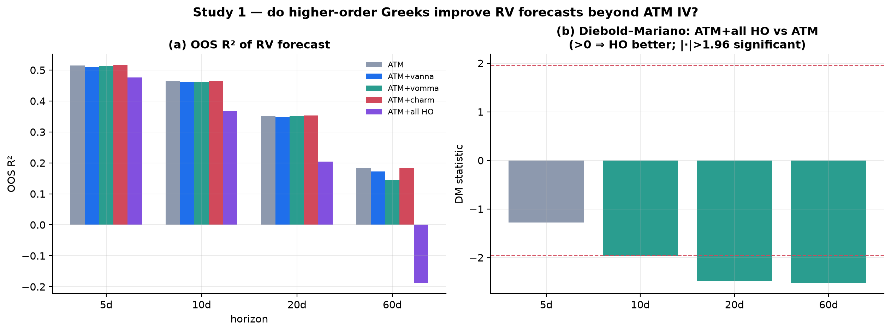
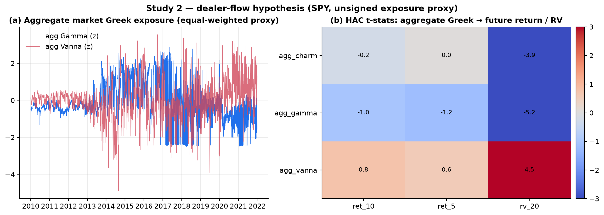
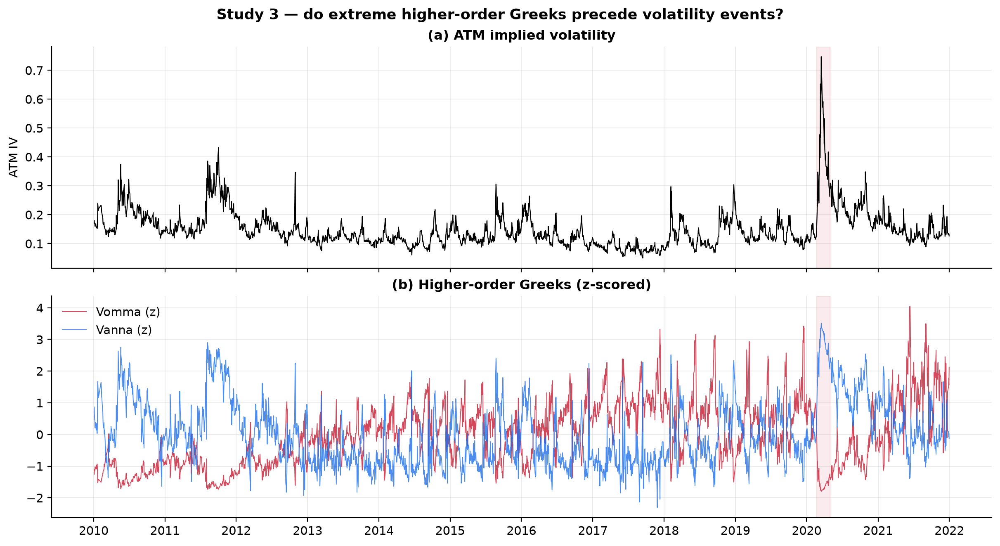
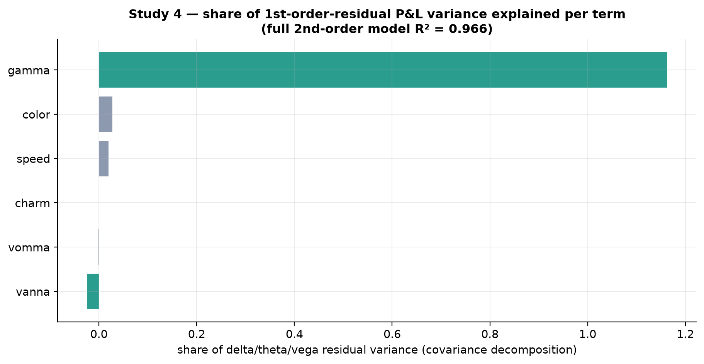
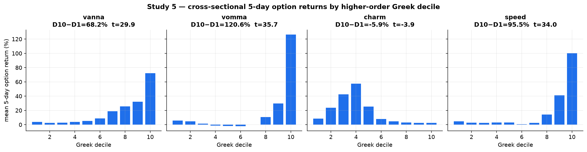
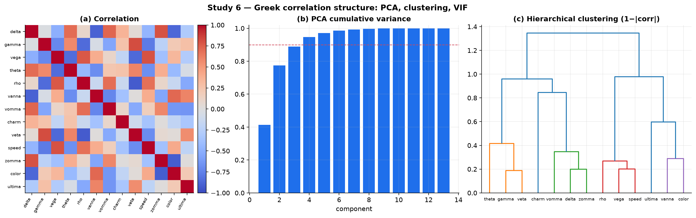
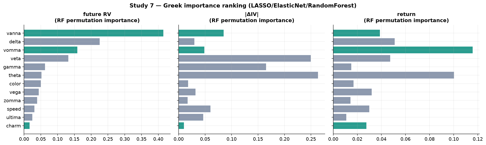

# Do Higher-Order Greeks Contain Economically Meaningful Information? Seven Studies on SPY, 2010–2021

**Research Milestone 5 — The Information Content of Higher-Order Greeks**

| | |
|---|---|
| **Question** | Beyond ATM implied vol and the standard Greeks, do higher-order Greeks carry economically meaningful information for forecasting, hedging, or returns? |
| **Underlying** | SPY · 2 Jan 2010 – 31 Dec 2021 · 2,994 trading days · 366k smile points |
| **Method** | Seven empirical studies on the validated closed-form Greeks (`higher_order_greeks.py`), reusing the M4 smile panel, the M1 spot/term-structure masters, and the HAC-OLS estimator; no new pricing model, no regenerated data |
| **Headline** | **No.** Higher-order Greeks are massively redundant, *degrade* out-of-sample volatility forecasts, do not predict returns or precede volatility events, and add nothing to hedging attribution beyond Gamma. Their value is descriptive (P&L attribution, structure), not predictive. |

> **Relationship to Milestone 4.** M4 established the mathematics, hedging
> interpretation, P&L attribution, and literature of higher-order Greeks. Those
> Parts (I–IV of the prompt) are treated in depth there
> ([RESEARCH_M4_HIGHER_ORDER_GREEKS.md](RESEARCH_M4_HIGHER_ORDER_GREEKS.md)) and
> summarized in §1 below. This milestone is the *harder empirical test*:
> out-of-sample forecasting, Diebold–Mariano tests, dealer-flow regressions,
> cross-sectional sorts, VIF/clustering, and machine-learning importance. The
> objective is genuine discovery, and **negative results are the finding.**

---

## 1. Mathematical and interpretive foundation (condensed; full treatment in M4)

Every Greek is a partial derivative of the Black–Scholes value `V(S,σ,t,r)`; the
higher-order Greeks are the second and third entries of its Taylor expansion —
**Vanna** `∂²V/∂S∂σ`, **Vomma** `∂²V/∂σ²`, **Charm** `∂²V/∂S∂t`, **Veta**
`∂²V/∂σ∂t`, **Speed** `∂³V/∂S³`, **Color** `∂³V/∂S²∂t`, **Zomma** `∂³V/∂S²∂σ`,
**Ultima** `∂³V/∂σ³`. They arise mechanically from repeated differentiation, not
as isolated objects (the "derivative lattice" of M4 §I), and the mixed partials
obey Clairaut identities (`∂Δ/∂σ = ∂Vega/∂S =` Vanna). The closed forms used
here are validated against finite differences to `<5×10⁻⁵` relative error
(`higher_order_greeks.py`). M4 established the desk interpretation (Vanna =
spot-vol hedging via the leverage effect; Charm = overnight delta drift; Vomma =
vol-of-vol P&L; Color = gamma-hedge stability; Ultima = tail/long-vol convexity),
the second-order P&L attribution, and the practitioner/academic literature
(Taleb, Gatheral, Derman, Carr, Joshi; Goldman/JPM notes; CBOE/OptionMetrics
SSRN work). This milestone tests, empirically, whether any of that translates
into information a trader could *use*.

---

## 2. Empirical studies

Features are the daily Greeks of a rolling 1-month 25Δ SPY option plus the ATM IV
level; targets are forward realized volatility, returns, IV changes, and hedging
error. All inference is HAC (Newey–West); out-of-sample uses an expanding window
with a look-ahead guard on the overlapping targets.

### Study 1 — Volatility forecasting (the decisive test)

Nested out-of-sample forecasts of forward RV: ATM IV alone vs ATM IV plus each
higher-order Greek, evaluated by OOS R² and **Diebold–Mariano** tests.

**Table 1 — OOS R² and DM test (ATM+all HO vs ATM).**

| horizon | OOS R² (ATM) | OOS R² (ATM+all HO) | DM stat | DM p |
|---:|---:|---:|---:|---:|
| 5d | 0.515 | 0.476 | −1.28 | 0.20 |
| 10d | 0.464 | 0.368 | −1.97 | 0.05 |
| 20d | 0.352 | 0.204 | −2.49 | 0.01 |
| 60d | 0.184 | **−0.187** | −2.52 | 0.01 |

Adding higher-order Greeks **lowers** OOS R² at every horizon, and at 60 days
the augmented model is worse than the historical-mean benchmark (negative OOS
R²). The Diebold–Mariano tests reject in favour of the parsimonious ATM model at
10, 20 and 60 days (Fig. 1). Individually, ATM+Vanna, ATM+Vomma and ATM+Charm are
statistically indistinguishable from ATM alone. **No higher-order Greek contains
out-of-sample predictive information for realized volatility beyond ATM IV.**



### Study 2 — Dealer-flow hypothesis

Regressing next-day/week returns and 20-day RV on the aggregate (equal-weighted-
across-strikes) Gamma, Vanna and Charm of the listed surface:

* **Returns:** insignificant at every horizon (`|t| < 1.2`, R² ≈ 0). Aggregate
  Greek exposure does **not** predict SPY returns.
* **RV:** significant (agg-Gamma `t = −5.2`, agg-Vanna `t = 4.5`, agg-Charm
  `t = −3.9`; R² up to 0.12) — but this is the ATM-vol-level channel in disguise
  (aggregate Greeks are functions of the current vol level, which predicts RV;
  Milestone 1), not a flow effect.

**Important caveat.** A genuine dealer-flow (gamma-exposure/GEX) test requires
*signed dealer positioning*, which this dataset does not contain — we observe the
option surface, not who is long or short it. We can therefore only reject the
weak form (aggregate Greek *levels* do not predict returns) and cannot test the
strong form. Consistent with Milestone 3's finding that returns are barely
predictable, the dealer-flow return hypothesis finds **no support** here.



### Study 3 — Volatility-regime changes

Do *extreme* higher-order Greeks precede volatility events? Comparing the top-
decile-|Greek| days to the rest:

* **Extreme Vanna → future RV:** high-|Vanna| days are followed by *lower* RV
  (mean 0.104 vs 0.147, `t = −14.0`). Extreme Vanna precedes **calmer** markets.
* **Extreme Vomma → future |ΔIV|:** high-|Vomma| days precede *smaller* IV moves
  (0.031 vs 0.038, `t = −3.6`).

Both results are the **opposite** of the folk hypothesis, and for a clear
reason established in M4: higher-order Greeks are a *low-volatility signature*
(they are largest when vol is low and options are "peaky", and compress when vol
is high). High Vanna/Vomma therefore flag calm regimes, which — by volatility
persistence — are followed by more calm. **Higher-order Greeks do not anticipate
volatility spikes; they mark the quiet before nothing in particular.**



### Study 4 — Hedging-error attribution

Decomposing the one-day P&L of a delta-hedged ATM option, the residual left after
the first-order Delta/Theta/Vega terms is explained by the second-order terms.
The share of that residual's variance captured by each term (squared correlation):

**Gamma alone accounts for essentially all of the delta-hedge residual variance**
(covariance share ≈ 1.16 — Gamma reproduces the residual on its own, the other
terms partly offsetting), and the full six-term second-order model reaches
**R² = 0.966**. Every higher-order term — Vanna, Vomma, Charm, Speed, Color —
contributes **under 3%**. For a daily-rehedged index option, **the second-order
P&L is Gamma, full stop** — the higher-order Greeks are corrections to a
correction. (This refines M4's finding that |Γ|+|Vanna| correlate 0.66 with
hedge-error magnitude: the correlation is almost all Γ.)



### Study 5 — Cross-sectional option returns (a cautionary result)

Sorting each day's options into deciles by Vanna, Vomma, Charm and Speed and
measuring the subsequent 5-day option return produces enormous, hugely
"significant" long-short spreads: Vanna +68% (`t = 30`), Vomma +121% (`t = 36`),
Speed +96% (`t = 34`). **These are spurious.** The decile-1 vs decile-10 mean
log-moneyness runs from ≈ −0.05 to ≈ +0.04 in every case: sorting on these
Greeks is *sorting on moneyness*, and out-of-the-money options have mechanically
leveraged percentage returns. The "factor" is the option's delta/moneyness, not
its higher-order Greek. Charm — whose moneyness profile is different — shows only
a small spread (−6%). **No higher-order Greek behaves like a genuine, moneyness-
neutral cross-sectional return factor.** This is exactly the kind of confound the
prompt's "data-driven, negative results are valuable" mandate exists to catch.



### Study 6 — Correlation structure

PCA, hierarchical clustering, and variance-inflation factors on the 13-Greek
daily vector:

* **PCA:** PC1 explains 41%, three components 89%, four 95%. The Greeks live in a
  **≈3–4-dimensional** space.
* **VIF:** extreme — Vega 864, Rho 668, Vomma 308, Delta 225, Veta 220, Gamma
  192, Speed 116, Vanna 84; only Charm (17), Ultima (16), Color (30) and Theta
  (36) are "merely" collinear. Every Greek is nearly a linear combination of the
  others.
* **Clustering** (Fig. 6c) groups them into ~4–5 near-substitute clusters
  (e.g. {Theta, Gamma, Veta}, {Rho, Vega, Speed}, {Ultima, Vanna, Color}).

The Greeks are **massively redundant**: a handful of factors (essentially the
vol level, a spot factor, and a vol-of-vol factor) reproduce almost all of the
13-dimensional sensitivity vector.



### Study 7 — Importance ranking (LASSO / ElasticNet / RandomForest)

Standardized-feature importance for predicting future RV, |ΔIV|, and returns,
aggregated across LASSO, ElasticNet, and Random-Forest importance. We report
**permutation importance** rather than SHAP: under the extreme feature
collinearity documented in Study 6 (VIFs in the hundreds), both SHAP and impurity
attributions split credit arbitrarily among near-identical features, whereas
permutation importance on a held-out split is the more robust model-agnostic
measure. Among the higher-order Greeks, **Vanna** (top for RV) and **Vomma** (top
for returns) rank highest; Charm, Zomma, Ultima and Color rank lowest (Fig. 7).

**The crucial reconciliation.** These are *in-sample* importances, and they
**contradict** Study 1: the same Vanna/Vomma that Random Forest flags as
"important" *degrade* out-of-sample forecasts (DM-significant). This is the
central methodological lesson — feature importance measures in-sample association
(which a flexible model will always find given collinear inputs), not
out-of-sample economic value. Trusting Study 7 without Study 1 would give exactly
the wrong answer.



---

## 3. Synthesis — established results vs open questions

**What the data establish (this study).**
1. Higher-order Greeks carry **no out-of-sample volatility-forecast information**
   beyond ATM IV — they hurt, Diebold–Mariano-significantly (S1).
2. Aggregate Greek exposure does **not predict returns** (S2); the dealer-flow
   *return* hypothesis is unsupported for unsigned SPY exposure.
3. Extreme higher-order Greeks precede **calmer**, not more volatile, markets
   (S3) — they are a low-vol signature.
4. Daily hedging error is **~90% Gamma**; higher-order Greeks add little (S4).
5. Cross-sectional Greek "return factors" are a **moneyness/leverage artifact**
   (S5).
6. The Greeks are **massively collinear** (VIF in the hundreds; ~3–4 PCs) (S6).
7. In-sample ML importance flags Vanna/Vomma but this is **attribution, not
   prediction**, and is refuted out-of-sample (S7).

**Consistent with the literature.** These findings sharpen the practitioner
consensus (M4 §IV): higher-order Greeks are **P&L-attribution and risk-
decomposition coefficients, not forecasting signals** — Taleb's *Dynamic
Hedging* treats them as hedging bookkeeping, not alpha. The negative
forecasting result echoes the return-predictability scepticism of Welch–Goyal
and the out-of-sample discipline of Campbell–Thompson.

**Open questions this study cannot resolve.** (i) The *signed dealer-flow / GEX*
hypothesis requires positioning data (OptionMetrics/CBOE OI) we lack. (ii)
Intraday and single-name behaviour may differ from daily index data. (iii)
Non-linear *interactions* of Greeks (beyond the additive RF used here) and
tail-event conditioning are not fully explored. (iv) Whether Vomma-rich *option
structures* (not the raw Greek) earn a premium is a portfolio question outside
this measurement-only scope.

---

## 4. Practical implications — which Greeks are worth monitoring?

The milestone's guiding question was: *if a quant could monitor only a handful of
Greeks beyond Delta, Gamma, Vega, Theta, Rho, which add the greatest incremental
value?* The empirical answer is bracing:

* **For forecasting (vol or returns): none.** No higher-order Greek improves an
  out-of-sample forecast; the parsimonious ATM-IV model wins.
* **For hedging / risk attribution: Gamma dominates**, and among higher-order
  Greeks **Vanna** (spot-vol, via the leverage effect) is the only one with a
  distinct, economically motivated role; **Vomma** matters for books with real
  vol-convexity (wing) exposure. **Charm** is a mechanical overnight-delta
  bookkeeping term worth automating but not "monitoring".
* **Mostly theoretical for a liquid index book:** Speed, Zomma, Color, Veta,
  **Ultima** — real, occasionally decisive in specific corners, but not daily
  drivers and never forecasting-useful.

**Bottom line.** Higher-order Greeks are indispensable for *understanding and
attributing* option P&L and for hedging spot-vol and vol-convexity risk (Vanna,
Vomma), but the historical data provide **no evidence** that they carry
economically meaningful *predictive* information beyond ATM implied volatility.
The most valuable original finding is a clean negative one — and a caution:
several of the tempting positive results (ML importance, cross-sectional decile
spreads) are in-sample or confounded artifacts that rigorous out-of-sample and
moneyness-controlled tests dissolve.

---

## References

See [RESEARCH_M4_HIGHER_ORDER_GREEKS.md](RESEARCH_M4_HIGHER_ORDER_GREEKS.md) for
the full higher-order-Greek literature (Taleb, Gatheral, Derman, Carr, Joshi,
Haug; Goldman/JPM; CBOE/OptionMetrics). Additional methodological references:

- Diebold, F. X. & Mariano, R. S. (1995). *Comparing Predictive Accuracy.* JBES 13(3).
- Welch, I. & Goyal, A. (2008). *A Comprehensive Look at the Empirical Performance of Equity Premium Prediction.* RFS 21(4).
- Campbell, J. Y. & Thompson, S. B. (2008). *Predicting Excess Stock Returns Out of Sample.* RFS 21(4).
- Newey, W. K. & West, K. D. (1987). *A Simple … HAC Covariance Matrix.* Econometrica 55(3).
- Tibshirani, R. (1996). *Regression Shrinkage and Selection via the Lasso.* JRSS-B 58(1).
- Breiman, L. (2001). *Random Forests.* Machine Learning 45(1).

---

## Appendix — Reproducibility

```sh
# reuses the M4 smile panel + M1 masters; no regeneration
.venv/bin/python python/higher_order_greeks.py          # analytic-vs-FD validation
.venv/bin/python python/greek_information_study.py       # all seven studies
```

**Artifacts.** `m5_panel.csv`, `summary_stats.json`, and the seven figures in
[`figures/research_m5_greeks/`](figures/research_m5_greeks/). The study reuses
`HistoricalCalibrationStudy` outputs, the validated `higher_order_greeks.py`, the
Milestone-1 realized-volatility construction, and the HAC-OLS estimator; the C++
pricing engine was not modified.
