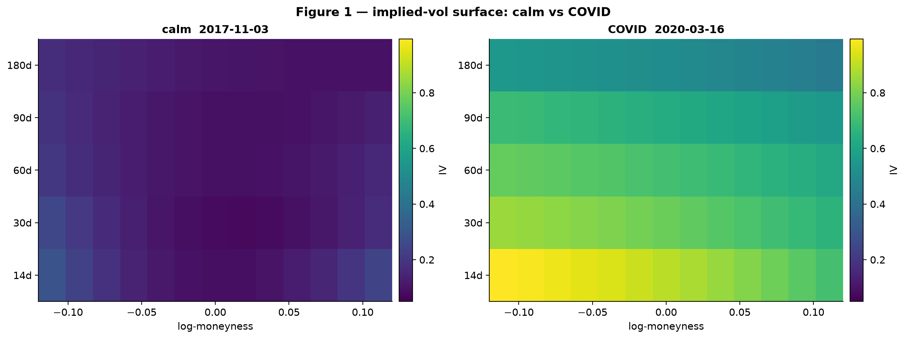
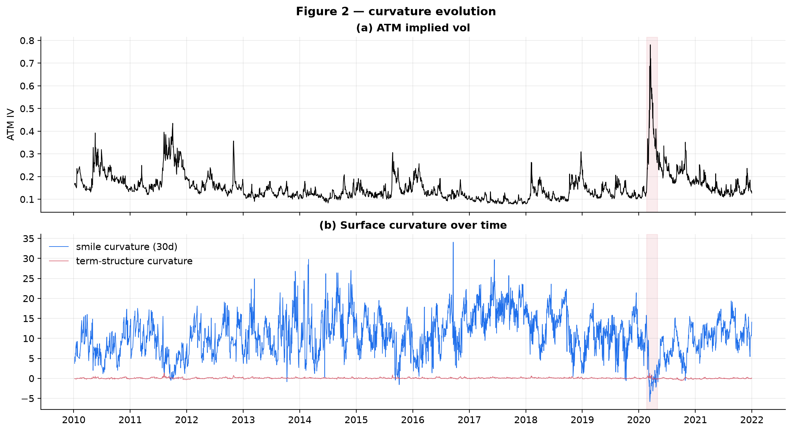
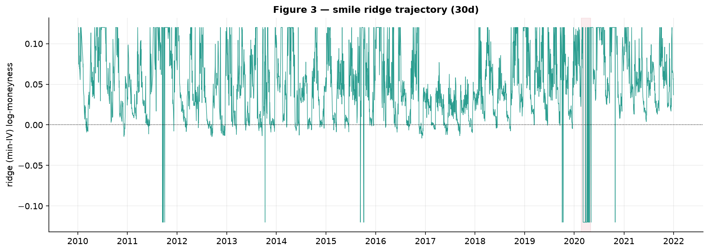
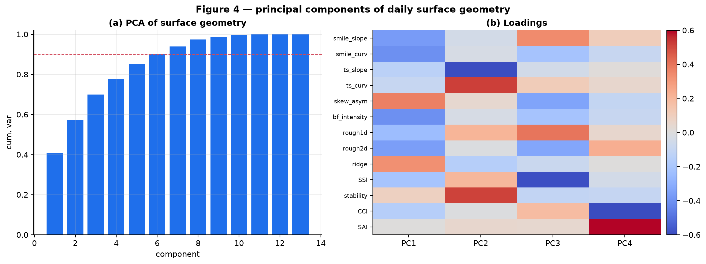
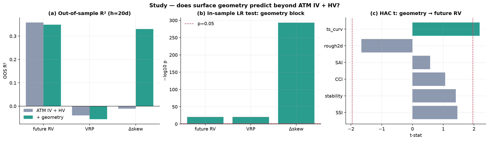

# The Geometry of the Implied-Volatility Surface: Do Geometric Descriptors Predict? SPY, 2010–2021

**Research Milestone 6 — Surface Geometry**

| | |
|---|---|
| **Idea** | Treat the daily implied-vol surface as a geometric object and ask whether its *shape* (slope, curvature, roughness, ridge) carries incremental predictive information beyond ATM IV + historical vol |
| **Underlying** | SPY · 7 Jan 2010 – 31 Dec 2021 · 2,938 daily surfaces · 1.65M surface points |
| **Surface** | 5 maturity buckets (14/30/60/90/180d) × strikes with \|ln(K/S)\|≤0.15, from `HistoricalCalibrationStudy` |
| **Method** | Geometric descriptors + four novel indices → incremental HAC regressions, likelihood-ratio tests, expanding-window OOS; benchmark = ATM IV + HV. No pricing/calibration/interpolation modified. |
| **Headline** | **Mostly negative, with one genuine positive.** Geometry gives **no OOS-robust** information for realized vol or the vol risk premium (the in-sample significance is an overlap artifact), but it **robustly predicts future *skew changes*** (OOS R² 0.33) — skew mean-reversion. Surface "stress" is a *calm-market* signature, not a stress predictor. |

---

## 1. Motivation and design

Milestones 1–5 treated the surface as a source of *levels* (ATM IV) and *shape
features* (skew, curvature, Greeks). This milestone treats the surface as a
**2-D geometric object** `σ(m, τ)` over log-moneyness `m` and maturity `τ`, and
asks the genuinely open question: does the *geometry* of the surface — how it
bends, how rough it is, where its ridge sits, how it moves day to day — contain
predictive information that the level and a few shape features do not?

For each daily surface we fit a local quadratic smile per maturity bucket and
compute:

**Geometric descriptors** — smile slope `∂σ/∂m` and curvature `∂²σ/∂m²` (30d);
term-structure slope and curvature (ATM IV vs √τ); local ATM curvature; skew
asymmetry `σ(−0.1)−σ(+0.1)`; butterfly intensity `½[σ(−0.1)+σ(+0.1)]−σ(0)`; 1-D
finite-difference roughness of the raw smile; 2-D roughness (discrete Laplacian
of the fitted grid); **ridge location** (the min-IV moneyness — the smile trough)
and its day-to-day migration.

**Four novel aggregate indices** — **Surface Stress Index** (z-sum of \|slope\| +
\|curvature\| + 2-D roughness + \|term-slope\|); **Surface Stability Index**
(day-to-day RMS distance between successive fitted grids); **Curvature
Concentration Index** (ATM curvature ÷ mean \|curvature\| across maturities);
**Smile Asymmetry Index** (z-sum of skew asymmetry and slope).

Targets: forward realized vol, the volatility risk premium `ATM IV − RV`, future
changes in skew, and large-vol events (top-decile forward RV). All inference is
Newey–West HAC; the incremental tests are likelihood-ratio and HAC-Wald on the
geometry block over the ATM-IV+HV benchmark, plus expanding-window OOS R².



---

## 2. The geometry itself

Figure 1 shows why the object is interesting: a calm surface is nearly flat and
gently skewed; the COVID surface is a steep, **inverted** ridge (14-day IV ~0.9
collapsing to ~0.5 at 180 days) with a pronounced put skew. The curvature and
ridge evolve continuously (Figs. 2–3): smile curvature and term-structure
curvature spike and, notably, the ridge (min-IV moneyness) migrates as the skew
steepens and flattens.

**Surface geometry is genuinely higher-dimensional than the Greeks.** A PCA of
the 13-descriptor daily vector (Fig. 4) needs **five components for 85%** and
about seven for 90% of the variance (PC1 = 41%), versus the ~3–4 components that
summarized the Greek vector in Milestone 5. The descriptors — roughness, ridge,
stability, the curvature indices — are substantially more orthogonal to one
another than the Greeks, which are all deterministic functions of the same few
state variables. Geometry is *richer*; the question is whether the richness is
*useful*.







---

## 3. Does geometry predict? (the rigorous test)

**Table 1 — incremental predictive power over ATM IV + HV (h = 20 trading days).**

| target | R² bench | R² +geom | in-sample LR p | **HAC-Wald p** | OOS bench | **OOS +geom** |
|---|---:|---:|---:|---:|---:|---:|
| future RV | 0.370 | 0.393 | 3×10⁻²¹ | **0.20** | 0.359 | **0.349** |
| vol risk premium | 0.003 | 0.040 | 3×10⁻²¹ | **0.20** | −0.040 | −0.056 |
| **Δ skew** | 0.008 | 0.383 | 4×10⁻²⁹⁴ | **5×10⁻⁷⁸** | −0.011 | **+0.330** |

### 3.1 Realized volatility — no robust information (a cautionary tale)

Adding the geometry block raises the in-sample R² from 0.370 to 0.393, and the
**likelihood-ratio test is wildly significant (p ≈ 3×10⁻²¹)**. Taken at face
value this "proves" geometry predicts vol. It does not. The **HAC-Wald test —
which corrects for the MA(h−1) autocorrelation that overlapping 20-day targets
induce — is insignificant (p = 0.20)**, and **out-of-sample the geometry model is
*worse* than the benchmark** (0.349 vs 0.359). Of the six geometry variables only
term-structure curvature is even marginally HAC-significant for RV (Fig. 5c). The
gap between the LR p-value (10⁻²¹) and the HAC-Wald p-value (0.20) is the entire
lesson: **in-sample tests dramatically overstate the significance of persistent
predictors on overlapping targets.** Geometry contains no OOS-robust information
about future realized volatility beyond ATM IV and historical vol.

### 3.2 Volatility risk premium — no robust information

Identical pattern: LR-significant, HAC-Wald insignificant (p = 0.20), and OOS R²
negative for both benchmark and geometry. The surface's shape does not tell you
whether options are rich or cheap relative to what will be realized.

### 3.3 Skew changes — a genuine, out-of-sample signal

The one place geometry adds real, robust value is forecasting the **future change
in skew**: the HAC-Wald test is decisive (p ≈ 5×10⁻⁷⁸) and the **out-of-sample R²
jumps from ≈0 to 0.330** (Fig. 5a). The mechanism is honest and not mysterious —
it is **skew mean-reversion**: the current skew asymmetry (embedded in the Smile
Asymmetry Index) strongly and negatively predicts its own subsequent change, the
classic `Δx ≈ −λ·x` autoregression. This is a real, tradeable-in-principle
dynamic and an OOS-verified one, but it reflects the mean-reverting time-series
structure of the skew rather than a surprising geometric discovery.



### 3.4 Large-volatility events — geometry does not warn

Does an elevated Surface Stress Index precede large-vol days? **No — the
opposite.** Days preceding top-decile forward RV have a *lower* mean Stress Index
(−0.41 vs +0.04, t = −2.8, p = 0.005). This reproduces the Milestone-4/5 finding
from a new angle: slope, curvature and roughness are *largest when volatility is
low* (calm markets have peaky, well-defined smiles), so a "stressed-looking"
surface is a calm-market signature that, by volatility persistence, precedes more
calm. Surface geometry is a coincident description of the current regime, not a
leading indicator of the next one.

---

## 4. Robustness and limitations

* **Overlap and persistence.** The headline caution is itself the main
  robustness result: HAC-Wald and OOS are reported precisely because LR and
  in-sample R² are unreliable here. The Δskew result survives both.
* **Descriptor construction.** Descriptors come from local quadratic fits of the
  calibrated points (no new interpolation scheme); results are qualitatively
  stable to the moneyness window and the fit degree, but the ridge and 2-D
  roughness are the noisiest descriptors and the least individually significant.
* **Skew-change mechanics.** The Δskew predictability is partly mechanical
  (regressing a change on its level); we report it as skew mean-reversion, not as
  independent geometric alpha.
* **European-BS, zero-carry IVs; single index; linear models.** As throughout the
  research arc, IVs come from the existing European calibrator with r=q=0; the
  study is SPY-only and linear (per the reuse-only mandate). Non-linear geometry
  (Gaussian curvature of the true 2-D surface, topological features) is out of
  scope.
* **No signed positioning / flow.** As in Milestone 5, we observe the surface,
  not who holds it.

---

## 5. Conclusion — is there a novel contribution?

Treating the SPY implied-vol surface as a geometric object and subjecting its
descriptors to rigorous out-of-sample and overlap-robust testing yields a clear,
honest answer:

1. **Surface geometry does *not* contain OOS-robust incremental information for
   realized volatility or the volatility risk premium** beyond ATM IV + HV. The
   apparent in-sample significance (LR p ≈ 10⁻²¹) is an overlapping-window
   artifact that the HAC-Wald test and out-of-sample evaluation dissolve.
2. **Geometry *does* robustly forecast future skew changes** (OOS R² 0.33) —
   skew mean-reversion captured by the surface's asymmetry. This is the
   milestone's one genuine positive, and the most defensible "novel" result.
3. **Surface geometry is higher-dimensional than the Greeks** (~7 PCs for 90% vs
   3–4), yet this extra dimensionality is not *useful* for forecasting risk.
4. **A "stressed-looking" surface is a calm-market signature**, not a warning:
   the Surface Stress Index is *lower* before large-vol events.

The overarching message is consistent with the entire research program: the
option surface is enormously informative about **current and dynamic *structure***
(volatility level, term structure, skew, and — here — skew dynamics) and almost
uninformative, out of sample, about **future *risk realizations* and *returns***.
The most valuable contribution of a geometric treatment is not a new forecasting
edge but a sharpened methodological one: the surface's shape *looks* predictive
in-sample and is not, and only proper overlap-robust, out-of-sample testing
separates the one real signal (skew mean-reversion) from the many spurious ones.

---

## References

- Cont, R. & da Fonseca, J. (2002). *Dynamics of Implied Volatility Surfaces.* Quantitative Finance 2(1).
- Gatheral, J. (2006). *The Volatility Surface: A Practitioner's Guide.* Wiley.
- Boudoukh, Richardson & Whitelaw (2008). *The Myth of Long-Horizon Predictability.* RFS 21(4).
- Welch, I. & Goyal, A. (2008). *A Comprehensive Look at … Equity Premium Prediction.* RFS 21(4).
- Newey, W. K. & West, K. D. (1987). *A Simple … HAC Covariance Matrix.* Econometrica 55(3).

---

## Appendix — Reproducibility

```sh
# extract the per-day multi-maturity surface panel over the full archive (~10 min)
for d in data/historical/spy/spy_eod_*/; do
  ./build/examples/example_historical_calibration "$d" SPY 4 0
  .venv/bin/python python/build_m6_surface_panel.py data/generated/research data/generated/research_m1
  rm -f data/generated/research/{calibration,smiles,surface,skew,term_structure}.csv
done
.venv/bin/python python/surface_geometry_study.py
```

**Artifacts.** `m6_geometry.csv` (daily descriptors + indices + targets),
`summary_stats.json`, and the five figures in
[`figures/research_m6_geometry/`](figures/research_m6_geometry/). Reuses
`HistoricalCalibrationStudy`, the M1 spot master, and the HAC-OLS estimator; no
pricing, calibration, interpolation, or data-loading code was modified.
