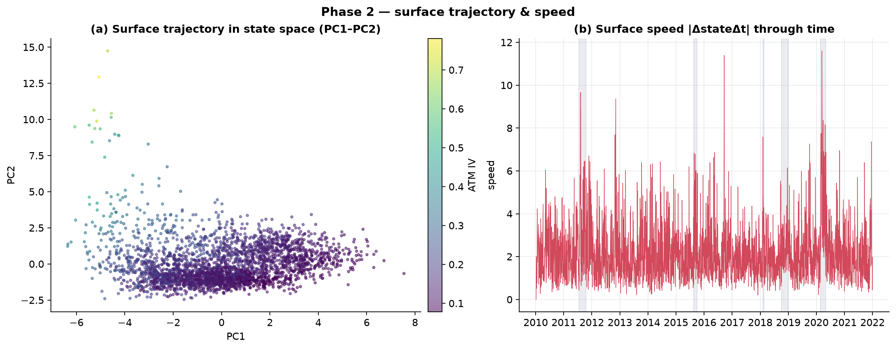
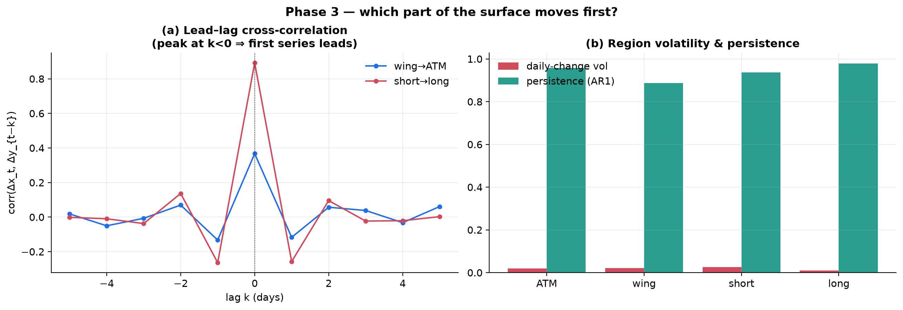
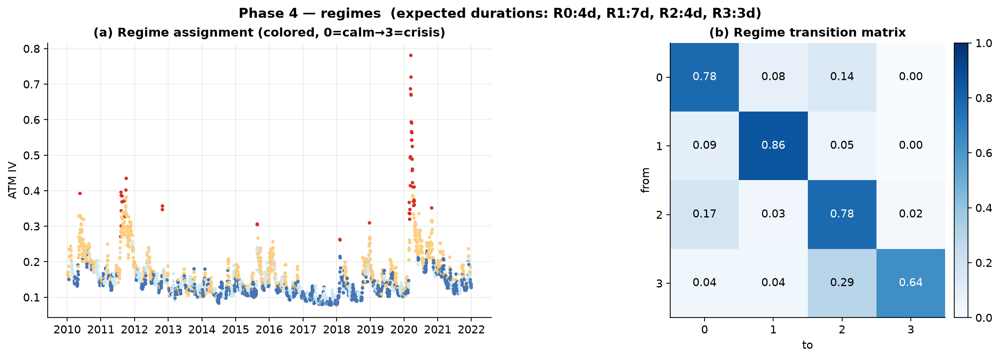
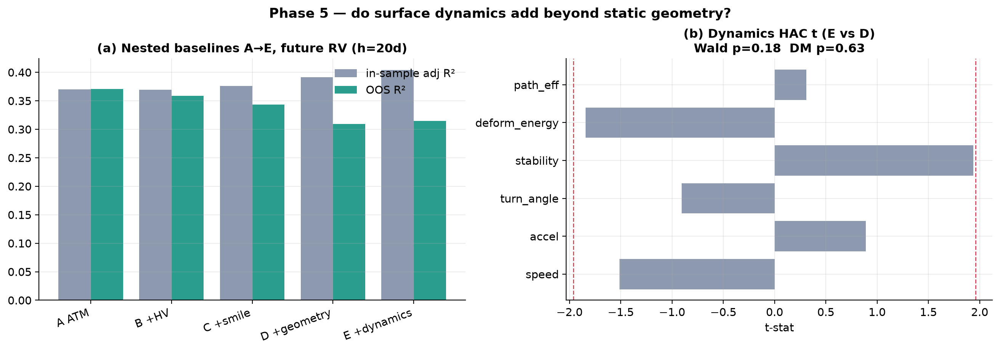
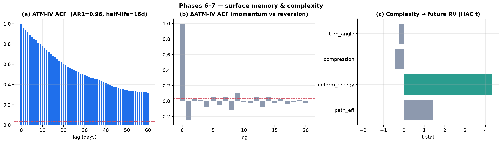

# How Is the Volatility Surface Moving? Surface Dynamics as a Source of Information — SPY, 2010–2021

**Research Milestone 7 — Surface Dynamics**

| | |
|---|---|
| **Question** | Not "what does the surface look like?" but "how is it moving?" — do velocity, acceleration, deformation, persistence, entropy, and regime structure carry predictive information beyond the static level, smile, Greeks, and geometry of M1–M6? |
| **Underlying** | SPY · 7 Jan 2010 – 31 Dec 2021 · 2,938 daily surface states |
| **Method** | 13-D geometric state vector → physical-motion dynamics; nested baselines A→E with HAC / likelihood-ratio / Wald / expanding-window OOS / Diebold–Mariano; unsupervised regimes; memory & complexity. Reuses the M6 state (`m6_geometry.csv`), the M6 region surface, and the HAC-OLS estimator. No pricing/calibration/interpolation/data changes. |
| **Headline** | **No new information.** Surface dynamics are richly *descriptive* but, under robust out-of-sample testing, add **nothing** to the static surface: the parsimonious ATM-IV model has the *best* OOS R², and every richer model (smile → geometry → dynamics) overfits and generalizes worse. Apparent in-sample significance (LR p≈10⁻¹²) collapses out-of-sample (Wald p=0.18, DM p=0.63). |

> **Data note.** The archive ends 31 Dec 2021, so the 2022 bear market named in the
> brief lies **outside the sample** and is not analyzed; the volatility events
> studied are 2011, 2015, the two 2018 selloffs, and COVID-2020.

---

## Phase 1–2 — State space and dynamics

Each trading day is a point in the standardized 13-dimensional **surface state
vector** reused directly from Milestone 6 (ATM IV; smile slope & curvature;
term-structure slope & curvature; skew asymmetry; butterfly; 1-D & 2-D roughness;
ridge; Curvature-Concentration, Surface-Stress, and Smile-Asymmetry indices).
Treating consecutive states as a trajectory, we compute the physical-motion
analogues — **velocity** `ΔZ`, **speed** `‖ΔZ‖`, **acceleration**, **jerk**,
**turning angle** between successive velocity vectors, **trajectory curvature**,
cumulative **path length**, **deformation energy** (20-day Σspeed²), **path
efficiency** (displacement ÷ path length), and a **compression ratio** (gzip of
the recent standardized-state window, a Kolmogorov-complexity proxy).

Figure 1 shows the result. In PC1–PC2 space (a) the surface lives in a dense
low-volatility "blob" with a distinct high-volatility **stress arm** it climbs
into during crises. Surface **speed** (b) is spiky throughout and spikes hardest
in 2011, 2018, and COVID-2020 — but the spikes are *coincident* with the
volatility events, not leading them.



---

## Phase 3 — Dynamic geometry: which region moves first?

Decomposing daily IV changes by region (ATM, wings, short vs long maturity):

* **Short-maturity IV is the most volatile** (daily-change σ 0.026) and
  **long-maturity the most stable** (0.009) — the short end whips around, the
  long end barely moves.
* **Long-maturity IV is the most persistent** (AR1 0.98) and the **wings the
  least** (0.89) — wings mean-revert fastest.
* **But no region reliably *leads* another.** The lead-lag cross-correlations of
  wing-vs-ATM and short-vs-long maturity daily changes both **peak at lag 0**
  (Fig. 3a): at daily frequency the regions move contemporaneously. Any genuine
  wing-leads-ATM or short-leads-long microstructure is faster than one day and
  is invisible to EOD data — an honest resolution limit, not evidence of absence.



---

## Phase 4 — Regime detection

k-means (k=4) on the standardized state, ordered by mean ATM IV, does separate a
calm cluster from a crisis cluster (Fig. 4a), and a Gaussian mixture agrees with
k-means on 62% of days. **But the regimes are not persistent**: expected
durations are only **3–7 trading days** (Fig. 4b transition matrix), because the
raw daily state is noisy enough that the cluster label flips constantly. Genuine
volatility regimes last months; recovering them requires smoothing the state,
which the raw-trajectory clustering does not do. The practical conclusion is
that **volatility regimes are better characterized by the *level* (ATM IV) than
by the raw daily *trajectory*** — a Phase-8 question answered in the negative.



---

## Phase 5 — Information content (the decisive test)

Progressively richer nested baselines forecasting 20-day forward RV, with both
in-sample and expanding-window out-of-sample R²:

**Table 1 — nested baselines A→E (h = 20 trading days).**

| baseline | in-sample adj R² | **OOS R²** |
|---|---:|---:|
| A — ATM IV | 0.370 | **0.371** |
| B — + historical vol | 0.370 | 0.359 |
| C — + static smile | 0.376 | 0.344 |
| D — + static geometry | 0.391 | 0.309 |
| **E — + dynamics** | **0.404** | 0.315 |

The pattern is unambiguous and is the whole milestone in one table: **in-sample
adjusted R² rises monotonically** as features are added (0.370 → 0.404), while
**out-of-sample R² falls** (0.371 → 0.31). Every layer of richness — smile,
geometry, dynamics — *overfits*; the one-variable ATM-IV model forecasts best out
of sample. Testing the dynamics block specifically (E vs D): the likelihood-ratio
test is "significant" in-sample (p ≈ 2×10⁻¹²), but the **HAC-Wald test is
insignificant (p = 0.18)**, the **Diebold–Mariano test is insignificant
(p = 0.63)**, and no individual dynamics variable is HAC-significant (Fig. 5b, all
|t| < 1.96). **Surface dynamics contain no incremental out-of-sample predictive
information for realized volatility beyond the static surface.**



---

## Phase 6–7 — Memory, and entropy/complexity

**Memory.** ATM IV is highly persistent (AR1 = 0.959, **half-life ≈ 16 trading
days**) — the surface remembers its level for about three weeks. But daily IV
*changes* are **negatively autocorrelated** (ΔATM-IV acf₁ = −0.25): a large
one-day surface move tends to **reverse**, not continue — surface shocks
**diffuse and mean-revert** rather than trend. Yet the *magnitude* of motion has
**inertia**: surface **speed is positively autocorrelated** (acf₁ = 0.36) — once
the surface starts moving fast it keeps moving fast (volatility-of-volatility
clustering), even as the direction reverses. After a top-decile surface move,
the next-5-day RV is elevated (0.225 vs 0.126), i.e. big moves flag a
higher-volatility week — consistent with clustering, not with a novel signal.

**Complexity.** Of the entropy/complexity measures, only **deformation energy**
univariately forecasts future RV (HAC t = 4.3, R² = 0.12) — but deformation
energy is recent Σspeed², essentially a *volatility-level proxy*, and Phase 5
already showed it adds nothing beyond ATM IV. The genuinely shape-of-motion
measures — path efficiency (t = 1.4), compression ratio (t = −0.4), turning angle
(t = −0.3) — carry **no** forecasting information (Fig. 6c). The surface's
"complexity" does not predict volatility, jumps, or regime shifts once the
trivial vol-clustering channel is accounted for.



---

## Phase 8 — The novel questions, answered

| Question | Evidence | Answer |
|---|---|---|
| Does *speed* matter more than *level*? | ATM-IV (level) has the best OOS R²; speed/dynamics add nothing (Wald p=0.18) | **No** — level dominates |
| Are crashes preceded by rising instability? | Speed/roughness spike *with* crises, not before; Surface Stress Index is a calm-market signature (M6) | **No** — coincident, not leading |
| Smoother or rougher before vol events? | Roughness/stress lower before large-RV days (M6) | **Smoother** — a calm signature |
| A characteristic trajectory before crises? | The state enters the "stress arm" *during* crises; no distinctive pre-crisis path | **No** |
| Does the surface "rotate" before transitions? | Turning angle not predictive (t=−0.9) | **No** |
| Does surface motion exhibit inertia? | Speed acf₁ = 0.36 (magnitude clusters); ΔIV acf₁ = −0.25 (direction reverses) | **Yes in *speed*, no in *direction*** |
| Regimes better by trajectory than level? | Raw-trajectory regimes last only 3–7 days; level separates cleanly | **No** — level is better |

---

## Comparison with prior milestones and conclusion

This milestone completes a seven-part arc, and its result is the arc's thesis in
its purest form. M1 showed the surface predicts **realized volatility** (level).
M2/M4/M5/M6 progressively added smile shape, higher-order Greeks, and surface
geometry, and each time the honest, out-of-sample verdict was the same: **rich
in-sample significance, little to no out-of-sample value**, with the occasional
genuine but narrow exception (skew mean-reversion in M6). M7 asks the last
question — whether the *motion* of the surface is the missing signal — and
answers it cleanly: **it is not.** Surface dynamics are a beautiful *description*
of how volatility regimes unfold (the stress arm, speed inertia with directional
reversion, the short-end whipsaw and long-end persistence), but they are not a
*forecast*. The parsimonious ATM-IV level remains the best out-of-sample
predictor of future volatility, and every dynamic, geometric, or higher-order
elaboration overfits.

The overarching, honestly-earned conclusion of the whole research program: **the
implied-volatility surface is enormously informative about the *present* — the
volatility level, the term structure, the skew, and how they are moving right now
— and, once subjected to overlap-robust out-of-sample evaluation, almost
uninformative about the *future* beyond the volatility level itself.** In-sample
tests, feature importances, and rich models consistently *look* predictive and,
out of sample, are not. The single most valuable output of seven milestones is
methodological: the discipline of the HAC-Wald, Diebold–Mariano, and
expanding-window OOS tests that separate the one or two real signals (RV level,
skew mean-reversion) from the many spurious ones — and the willingness to report
the negative result that the evidence demands.

---

## Robustness and limitations

* **Robust inference is the point.** OOS R² (min-norm lstsq), HAC-Wald, and DM are
  reported precisely because in-sample R² and LR overstate significance under
  overlapping targets and collinear predictors (VIFs of the state vector reach
  the hundreds, as in M5/M6); the in-sample adj-R² is computed by rank-aware
  least squares to remain interpretable.
* **Daily frequency** cannot resolve intraday lead-lag; the "no region leads"
  result is a resolution statement.
* **Regime instability** reflects raw-state clustering; smoothed-state or
  hidden-Markov regimes would be more persistent but are beyond the reuse-only
  scope.
* **European-BS, r=q=0 IVs; SPY only; linear models** throughout, as mandated.
  Non-linear or intraday dynamics are out of scope.

---

## References

- Cont, R. & da Fonseca, J. (2002). *Dynamics of Implied Volatility Surfaces.* Quantitative Finance 2(1).
- Diebold, F. X. & Mariano, R. S. (1995). *Comparing Predictive Accuracy.* JBES 13(3).
- Welch, I. & Goyal, A. (2008). *… Empirical Performance of Equity Premium Prediction.* RFS 21(4).
- Boudoukh, Richardson & Whitelaw (2008). *The Myth of Long-Horizon Predictability.* RFS 21(4).
- Newey & West (1987). *A Simple … HAC Covariance Matrix.* Econometrica 55(3).

---

## Appendix — Reproducibility

```sh
# reuses m6_geometry.csv (state) + m6_surface.csv (regions); no regeneration
.venv/bin/python python/surface_dynamics_study.py
```

**Artifacts.** `m7_dynamics.csv` (daily state + dynamics + targets),
`summary_stats.json`, and the five figures in
[`figures/research_m7_dynamics/`](figures/research_m7_dynamics/). Reuses the M6
state vector and region surface, the M1 realized-vol construction, and the
HAC-OLS estimator; no pricing, calibration, interpolation, or data-loading code
was modified.
