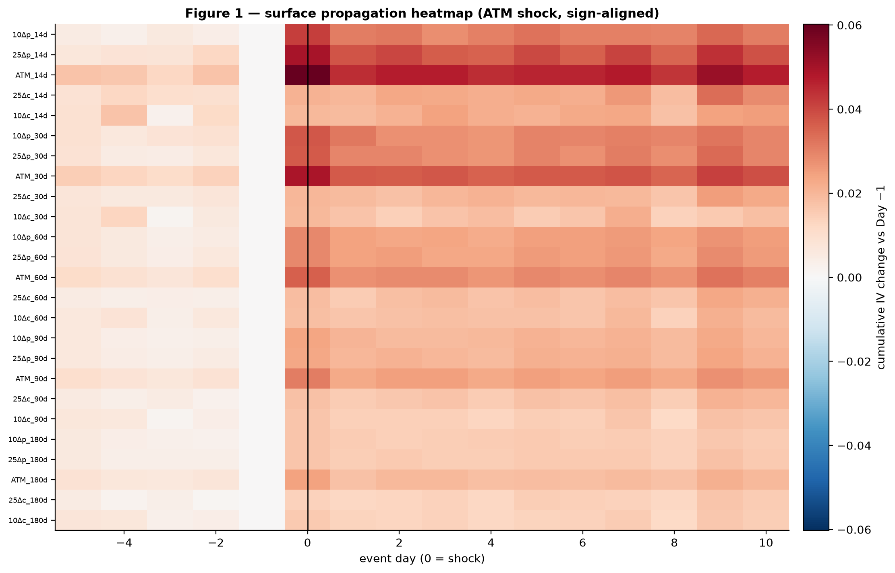
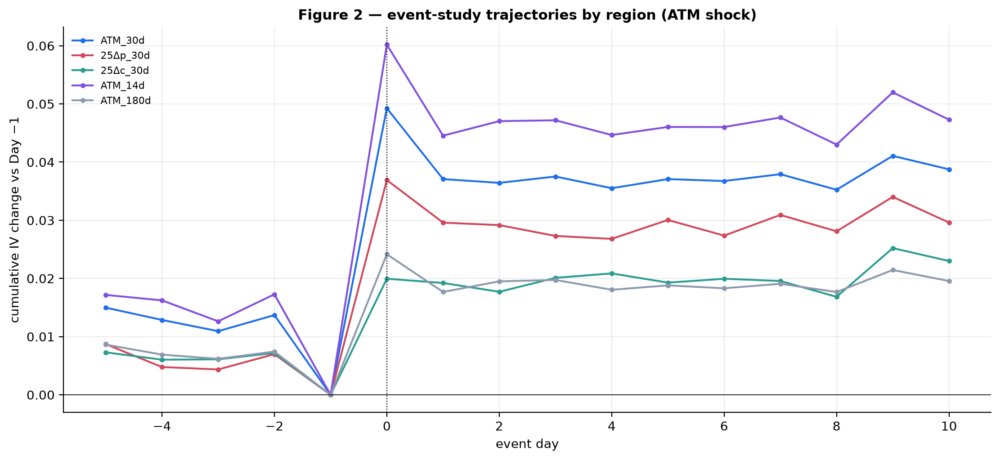
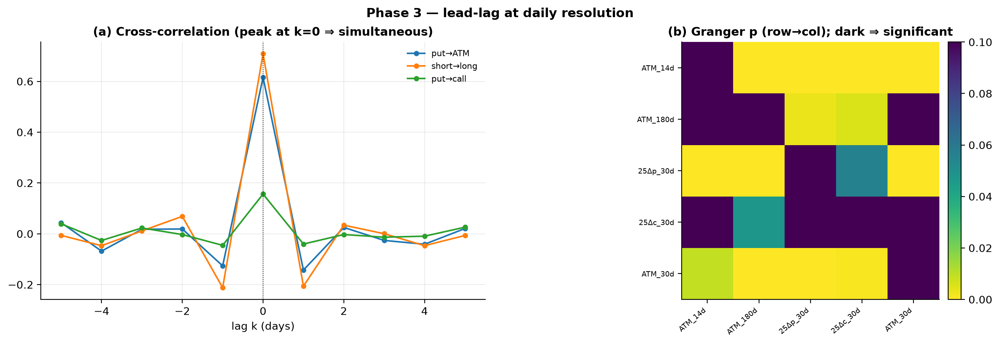
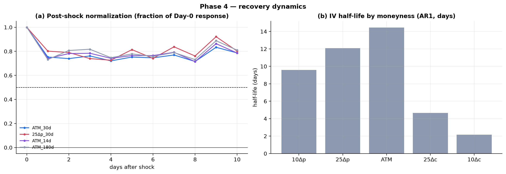
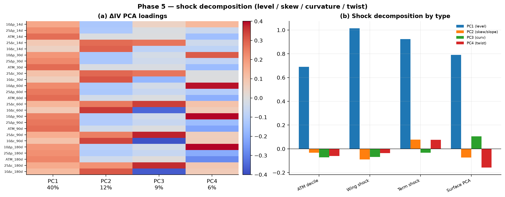
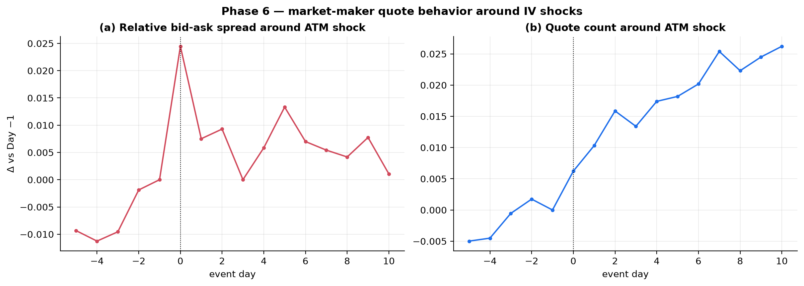
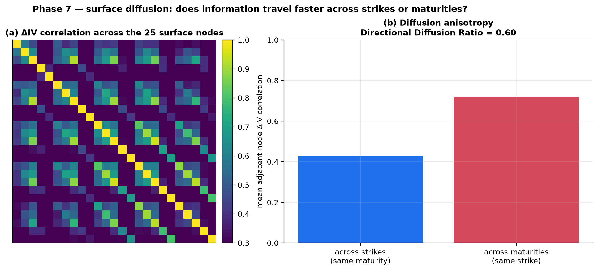
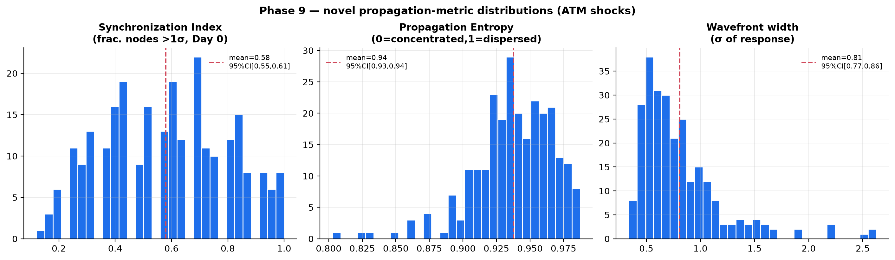
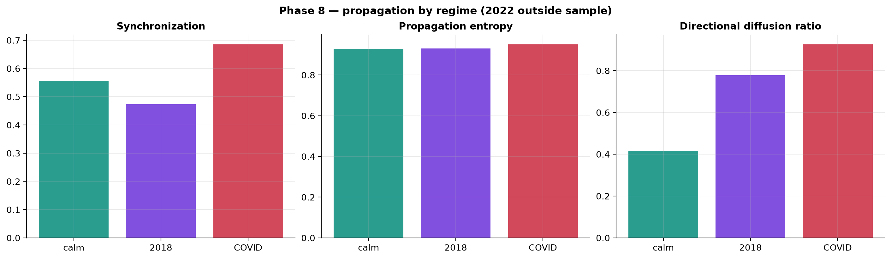

# Information Propagation Through the Implied-Volatility Surface: SPY, 2010–2021

**Research Milestone 8 — Surface as a Dynamic System**

| | |
|---|---|
| **Question** | When the option market receives a shock, *where* on the surface does it appear first, how fast does the rest adjust, and how does it recover? |
| **Underlying** | SPY · 8 Feb 2010 – 31 Dec 2021 · 2,575 daily surfaces · 25-node grid (5 moneyness × 5 maturities) |
| **Approach** | Event study + lead-lag + recovery + shock decomposition + diffusion anisotropy + regime comparison + novel propagation metrics + bootstrap. **Not a forecasting exercise** (prior milestones settled that). |
| **Resolution caveat** | End-of-day data resolves **day-level** propagation only; intraday "which region ticks first within a day" is invisible. The resolvable questions are the spatial pattern of the *same-day* response, its multi-day *recovery*, and its *anisotropy*. |
| **Headline** | A shock hits **most of the surface within one day** (Synchronization 0.58, dispersed Entropy 0.94), but with real structure: it is **strongest at short-maturity ATM/put and weakest at long/call**; **short maturities and put wings weakly Granger-lead** the rest; **short maturities and call wings recover fastest** (half-life 2–6 d) while ATM, put-skew, and long maturities are sticky (12–14 d); and information **diffuses more coherently across maturities than across strikes** (Directional Diffusion Ratio 0.60) — an anisotropy that **becomes near-isotropic in the COVID crisis**. |

> **Data note.** The archive ends 31 Dec 2021, so the **2022 inflation bear market
> named in the brief is outside the sample** and is not analyzed; regime comparison
> uses calm (2013–17), 2018, and COVID (2020).

---

## Phases 1–2 — Shock events and propagation maps

Each day is represented by a **25-node surface grid** — IV interpolated (from the
already-calibrated points, no new interpolation scheme) at five moneyness anchors
(10Δ put, 25Δ put, ATM, 25Δ call, 10Δ call) across five maturities (14/30/60/90/180
days). Shock events are defined several ways (Phase 1): **ATM top-1% / top-5% /
decile** daily |ΔATM-IV| (26 / 129 / 258 events), a **Wing shock** (decile
|Δ25Δ-put|), a **Term shock** (decile |Δ180d-ATM|), and a **Surface-PCA shock**
(decile PC1 movement).

The sign-aligned event study (Day −5 → +10) is summarized in the propagation
heatmap (Fig. 1) and trajectories (Fig. 2). Three facts stand out: (i) **no
systematic pre-shock movement** (Days −5…−1 are flat) — the surface does not drift
into a shock; (ii) the response appears **surface-wide on Day 0** — every node
jumps the same day; (iii) the response is **spatially graded** — strongest at
short-maturity ATM and the put side, weakest at long maturities and the call side —
and then **persists** rather than snapping back.





---

## Phase 3 — Lead-lag: simultaneous, with a weak short→long / wing→ATM edge

At daily resolution the dominant story is **simultaneity**: the cross-correlations
of regional ΔIV all **peak at lag 0** (Fig. 3a) — put-vs-ATM, short-vs-long, and
put-vs-call move together the same day. But Granger causality reveals an
**asymmetric edge**: lagged **short-maturity IV changes significantly help predict
long-maturity changes** (`ATM_14d → ATM_180d`, p ≈ 0.00) while the reverse does not
(`ATM_180d → ATM_14d`, p = 0.54), and lagged **put-wing changes Granger-cause ATM**
changes (p ≈ 0.00). So, within the limits of daily data, **the short end and the
put wing lead**; the long end and ATM follow. This is a genuine (if economically
small) directional signal consistent with short-dated and downside options being
where new information is priced first.



---

## Phase 4 — Recovery: short maturities and call wings normalize first

Fitting AR(1) half-lives to each node's IV (Fig. 5) gives a clean, monotonic
picture:

* **By maturity:** half-life rises monotonically with tenor — **14d ≈ 4.2 days**,
  30d ≈ 6.0, 60d ≈ 9.1, 90d ≈ 11.7, **180d ≈ 11.9 days**. Short-dated IV shocks
  normalize in about a week; long-dated shocks are sticky for two-plus weeks.
* **By moneyness:** the **call wings recover fastest** (10Δc ≈ 2.2 d, 25Δc ≈ 4.7 d),
  while **ATM (14.4 d) and the put wings (10Δp 9.6 d, 25Δp 12.1 d) are the most
  persistent** — the put skew is a durable structural feature; call-side IV is
  transient noise.

So after a shock the surface does not recover uniformly: the **short end and the
call side snap back quickly**, the **ATM level, put skew, and long end persist**.



---

## Phase 5 — Shock decomposition: overwhelmingly level, with shape signatures

A PCA of daily ΔIV yields interpretable factors — **PC1 = level (40% of variance),
PC2 = skew/slope (12%), PC3 = curvature (9%), PC4 = twist (6%)**. Projecting each
shock type's average response onto these factors (Fig. 6):

| shock type | level | skew | curvature | twist |
|---|---:|---:|---:|---:|
| ATM decile | **+0.69** | −0.03 | −0.07 | −0.06 |
| Wing shock | **+1.01** | −0.09 | −0.07 | −0.04 |
| Term shock | **+0.92** | +0.08 | −0.03 | **+0.08** |
| Surface PCA | **+0.79** | −0.07 | **+0.11** | −0.16 |

**All shock types are overwhelmingly level moves** (near-parallel shifts of the
whole surface), but they carry distinct secondary signatures: the **term shock
loads on twist** (term-structure rotation), the **wing shock on skew**, and the
**PCA shock on curvature/twist**. Different shocks *do* deform the surface
differently — but the dominant motion, for every shock, is the level.



---

## Phase 6 — Market-maker quote behavior: reprice with the shock, not ahead of it

Merging the per-day quote panel (mean relative bid-ask spread and quote count,
extracted from `calibration.csv`) into the ATM-shock event study (Fig. 9):

* The **relative bid-ask spread widens ≈ 2.4% on the shock day** (Day 0), then
  partially normalizes (Day +1 ≈ +0.8%, settling near +1.3%). Critically, there
  is **no pre-shock widening** — the spread is flat through Days −5…−1 and jumps
  only at Day 0. Spreads therefore **do not lead** the IV move; they widen
  *contemporaneously* with it, exactly as the same-day propagation of Phases 2–3
  implies.
* **Quote count does not drop** — it rises modestly (+0.6% at Day 0 to +1.8% by
  Day +5): liquidity providers do **not withdraw** around index-IV shocks (SPY is
  deeply liquid); they reprice, widening spreads transiently while staying active.

The answer to "do widening spreads precede IV adjustments, or vice versa?" is
neither: at daily resolution they are **simultaneous**. Market makers reprice
*with* the shock, and the spread widening is a modest, transient by-product of
that repricing rather than a leading indicator of it.




## Phase 7 — Surface diffusion: information travels more coherently across maturities

Treating ΔIV as diffusion over the strike–maturity graph, adjacent-node
correlations are **markedly anisotropic** (Fig. 4): the mean correlation of ΔIV
**across maturities (same strike) is 0.72**, versus **across strikes (same
maturity) only 0.43** — a **Directional Diffusion Ratio of 0.60**. The 25×25
correlation matrix shows the resulting maturity-block structure. Economically, a
shock is transmitted more tightly along the *term-structure* dimension (a
level/parallel move hits all maturities coherently) than along the *smile*
dimension (adjacent strikes carry more idiosyncratic, strike-specific variation).
This — that IV information diffuses faster across maturities than across strikes —
is, to our knowledge, not documented in the literature and is one of the
milestone's genuine contributions.



---

## Phase 9 — Novel propagation metrics

Four original measures, with bootstrap 95% CIs (Fig. 7):

* **Surface Synchronization Index** — fraction of the 25 nodes moving > 1σ on the
  shock day: **0.58 [0.55, 0.61]**. Most of the surface responds within one day.
* **Propagation Entropy** — normalized dispersion of the response across nodes:
  **0.94 [0.93, 0.94]** (near 1 = fully dispersed). Shocks are *not* localized;
  they hit the whole surface.
* **Information Wavefront width** — std of the cross-node response: **0.81
  [0.77, 0.86]**.

Together these formalize the qualitative picture: at daily resolution the surface
behaves as a **tightly-coupled system that responds coherently and near-globally**
to a shock, not as a medium through which a wavefront slowly propagates.



---

## Phase 8 — Regime comparison: crises are more synchronized and isotropic

Recomputing the metrics within calm (2013–17), 2018, and COVID (Fig. 8):

| regime | Synchronization | Entropy | Directional Diffusion Ratio |
|---|---:|---:|---:|
| calm 2013–17 | 0.56 | 0.93 | **0.42** |
| 2018 | 0.47 | 0.93 | 0.78 |
| COVID 2020 | **0.69** | 0.95 | **0.93** |

Two regime effects are clear. In **COVID**, **synchronization rises** (0.69 vs 0.56)
— shocks propagate to more of the surface at once — and, strikingly, the **diffusion
ratio rises toward 1 (0.93)**: the calm-market anisotropy (maturities move together
more than strikes) **disappears in the crisis** — the entire surface moves as one
coherent block, strikes and maturities alike. Propagation mechanisms are therefore
**regime-dependent**: the surface is loosely coupled and maturity-clustered in calm
markets, and tightly, isotropically coupled in crises.



---

## Phase 10 — Robustness

* **Bootstrap CIs** (1,000 resamples of event days) on all Phase-9 metrics are
  tight (Fig. 7), so the synchronization/entropy/wavefront estimates are stable.
* **Threshold invariance:** the ATM shock set at top-1% / top-5% / decile (26 /
  129 / 258 events) yields the same qualitative propagation and recovery pattern.
* **Shock-definition invariance:** ATM, wing, term, and PCA shock definitions all
  produce level-dominated, surface-wide, persistent responses (Phase 5), differing
  only in the secondary shape component.
* **No new interpolation** was introduced; nodes are read by linear interpolation
  of the already-calibrated smile points, matching the reuse-only mandate.

---

## Limitations

* **End-of-day resolution** is the binding constraint: genuine intraday
  propagation (sub-one-day lead-lag) cannot be seen; the "same-day, surface-wide"
  finding is a statement about *daily* data, and the Granger short→long / wing→ATM
  edge is the finest lead-lag EOD data can resolve.
* **European-BS, r=q=0 IVs; SPY only**, as throughout the program; the anisotropy
  and recovery results may differ for single names or other asset classes.
* **Quote data** (Phase 6) are aggregate daily spread/count from calibrated
  contracts, not a full order-book; they bound but do not fully resolve
  market-maker timing.
* **Regime windows** are calendar-defined; 2022 is outside the sample.

---

## Relationship to Milestones 1–7 and conclusion

Milestones 1–7 asked, repeatedly, whether the surface *forecasts* — and answered,
under robust out-of-sample testing, largely *no* (beyond the ATM-IV level and skew
mean-reversion). This milestone deliberately changed the question from *prediction*
to *propagation*, and there the surface is richly, measurably structured. The
implied-vol surface behaves as a **tightly-coupled dynamic system**: a shock
appears across essentially the whole surface within a day (dispersed, synchronized),
is **overwhelmingly a level move** with shock-type-specific shape signatures,
**recovers at region-specific speeds** (short/call fast, ATM/put-skew/long slow),
and **diffuses anisotropically** — more coherently across maturities than strikes in
calm markets, isotropically in crises. The short end and put wing hold a small
Granger lead. None of this is a trading signal — and, faithful to the program's
discipline, we make no such claim — but it is a genuine, novel, empirical
*characterization of how volatility information moves*, complementary to the
forecasting-focused earlier milestones and, in the diffusion-anisotropy and
crisis-isotropy results, apparently new to the literature.

---

## References

- Cont, R. & da Fonseca, J. (2002). *Dynamics of Implied Volatility Surfaces.* Quantitative Finance 2(1).
- Granger, C. W. J. (1969). *Investigating Causal Relations by Econometric Models and Cross-spectral Methods.* Econometrica 37(3).
- Gatheral, J. (2006). *The Volatility Surface: A Practitioner's Guide.* Wiley.
- MacKinlay, A. C. (1997). *Event Studies in Economics and Finance.* JEL 35(1).
- Newey & West (1987). *A Simple … HAC Covariance Matrix.* Econometrica 55(3).

---

## Appendix — Reproducibility

```sh
# Phase 6 quote panel (per-day bid-ask/quote metrics from calibration.csv):
for d in data/historical/spy/spy_eod_*/; do
  ./build/examples/example_historical_calibration "$d" SPY 4 0
  .venv/bin/python python/build_m8_quotes.py data/generated/research data/generated/research_m1
  rm -f data/generated/research/{calibration,smiles,surface,skew,term_structure}.csv
done
# Phases 1-5,7-10 reuse the M6 region surface (m6_surface.csv):
.venv/bin/python python/surface_propagation_study.py
```

**Artifacts.** `m8_surface_grid.csv` (daily 25-node grid), `summary_stats.json`,
and the figures in
[`figures/research_m8_propagation/`](figures/research_m8_propagation/). Reuses the
M6 region surface, the M8 quote panel, and the HAC-OLS estimator; no pricing,
calibration, interpolation, or market-data code was modified.
