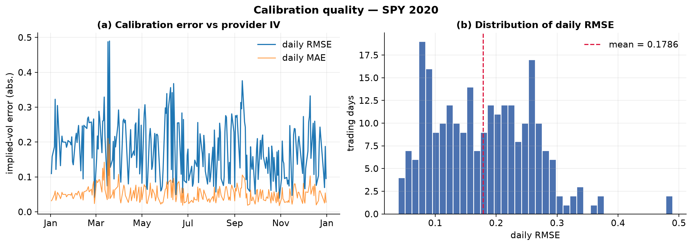
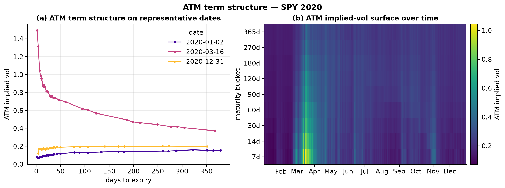
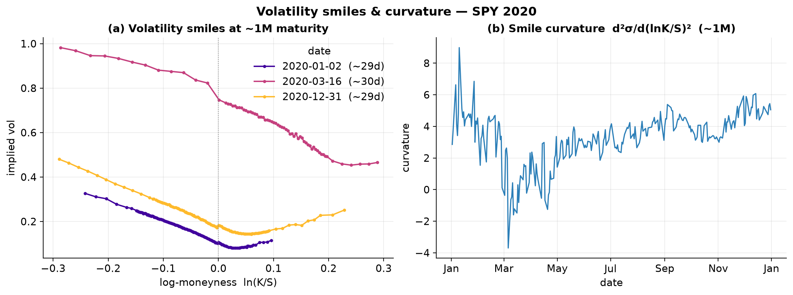
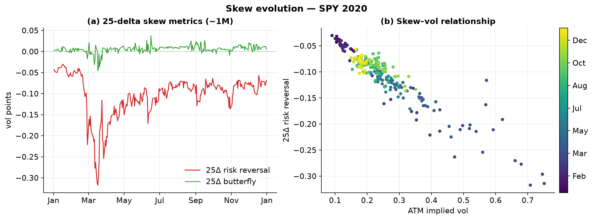
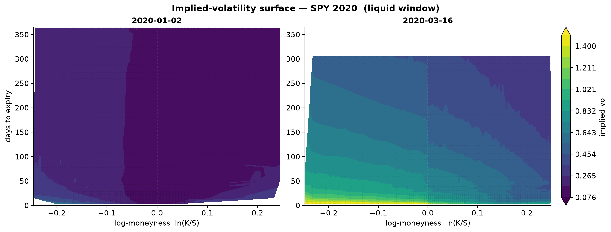

# Implied-Volatility Dynamics of SPY Options Through the 2020 COVID-19 Shock

**A calibration study built on `HistoricalCalibrationStudy`**

| | |
|---|---|
| **Underlying** | SPY (SPDR S&P 500 ETF), listed options |
| **Period** | 2 Jan 2020 – 31 Dec 2020 (250 trading days) |
| **Data** | OptionsDX / Delta-Neutral end-of-day archive, `data/historical/spy/spy_eod_2020-*` |
| **Engine** | `ore::analytics::OptionChainCalibrator` + `volatility_analytics` (unchanged) |
| **Driver** | `example_historical_calibration` → five long-format CSVs |
| **Analysis** | `python/calibration_research.py` (pandas / matplotlib) |
| **Contracts** | 2,328,802 seen · 2,167,201 calibrated (93.1%) · 160,654 skipped · 947 solver failures |

---

## Abstract

We calibrate Black–Scholes implied volatilities to every quoted SPY option on
every trading day of 2020 and reconstruct the daily volatility smile, ATM term
structure, surface, and 25-delta skew. The Newton/​bisection IV solver
reproduces every mid-price to a mean residual of **1.4 × 10⁻¹¹**, i.e. the
price-space calibration is essentially exact. Over the year the 1-month ATM
level rose from **10.4%** to a peak of **75.1%** (16 Mar), the term structure
inverted into steep backwardation, and the 25-delta risk reversal fell to
**−31.7 vol points** (17 Mar). The single strongest empirical regularity is the
**leverage effect**: the 1-month risk reversal and ATM level are correlated at
**ρ = −0.94** — as volatility rises, downside skew steepens almost
mechanically. All results are produced without modifying any pricing or
calibration code.

---

## 1. Data and methodology

### 1.1 Underlying and data placement

We use **SPY**, the most liquid single listed-option chain in the U.S. market,
which guarantees a dense strike/expiry grid on every date. The raw archive is
the OptionsDX / Delta-Neutral end-of-day export, one plain-text file per month,
stored under:

```
data/historical/spy/
└── spy_eod_2020-kwe0mi/
    ├── spy_eod_202001.txt   … spy_eod_202012.txt   (12 monthly files)
```

Each row carries one strike and both the call and put quote/Greeks side by
side; `HistoricalLoader::load_from_eod` groups rows by `QUOTE_DATE` into daily
`OptionChain`s. No other placement or preprocessing is required — the loader
recurses the directory and ignores non-`.txt/.csv` entries.

### 1.2 The pipeline

The study is a thin driver over existing infrastructure and adds **no new
model**:

1. `HistoricalResearchEngine` iterates the 250 daily chains (4 worker threads).
2. For each day, `HistoricalCalibrationStudy::process` runs
   `OptionChainCalibrator::calibrate` (recover σ such that European
   Black–Scholes reprices the mid), then the `volatility_analytics` free
   functions `build_smiles`, `build_term_structure`, `build_surface`,
   `compute_skew_metrics`.
3. `end()` writes five date-tagged, long-format CSVs to
   `data/generated/research/`: `calibration.csv` (434 MB), `smiles.csv`,
   `surface.csv`, `term_structure.csv`, `skew.csv`.

Reproduce with:

```sh
cmake -S . -B build -DORE_BUILD_EXAMPLES=ON && cmake --build build -j
./build/examples/example_historical_calibration data/historical/spy/spy_eod_2020-kwe0mi SPY 4 0
python/calibration_research.py            # → figures/ + summary_stats.json
```

### 1.3 Analysis conventions

* **Moneyness** is log-simple, `m = ln(K/S)`; ATM is `m = 0`.
* **Smiles** use the standard **out-of-the-money** construction (puts for
  `m < 0`, calls for `m ≥ 0`) — one IV per strike.
* A **"1-month"** series is the expiry nearest 30 calendar days on each date.
* **Curvature** is `d²σ/dm²`, the leading coefficient of a quadratic fit to the
  1-month OTM smile over `|m| ≤ 0.30`.
* **25-delta risk reversal** `= σ(25Δ call) − σ(25Δ put)`; **butterfly**
  `= ½[σ(25Δ call) + σ(25Δ put)] − σ(ATM)`.
* Rates and dividends are set to **zero** (loader default) and exercise is
  treated as **European** — see §4.

The large CSVs are streamed in chunks; the whole analysis runs in ~6 s.

---

## 2. Results

### 2.1 Calibration quality — the fit is exact; provider agreement is not

Two different questions hide behind "calibration RMSE", and they give very
different answers (Fig. 1).

* **Price space.** The solver converged on **100%** of attempted contracts with
  a mean price residual of **1.4 × 10⁻¹¹**. In the sense of "does the recovered
  σ reprice the option," calibration is exact.
* **Implied-vol space, vs the vendor's published IV.** Here the mean absolute
  error is **0.053** (5.3 vol points) but the RMSE is **0.198**. The factor-of-4
  gap between MAE and RMSE is the story: agreement is tight for the liquid core
  and blows up on a thin tail of **low-vega, deep-in-the-money / long-dated
  contracts**, where a negligible price difference maps to a huge IV difference.
  Daily RMSE is elevated but stable (median 0.178), worsening in the crash
  (regime RMSE 0.203 → 0.231 → 0.186 across pre-crash / crash / recovery) and
  peaking on **19 Mar (0.49)**.

**Takeaway:** the IV-vs-provider RMSE is a poor headline calibration metric —
it measures modelling-assumption mismatch on illiquid strikes, not solver
quality. MAE (5 vol points) is the honest central figure, and it is fully
explained by the zero-rate / European assumptions of §4.



### 2.2 ATM term structure — level and inversion

The 1-month ATM level (Fig. 2a, 2b) traces the entire COVID cycle: **10.4%** on
2 Jan, a spike to **75.1%** on **16 Mar**, and a partial normalisation to
**18.1%** by year-end — still ~1.7× its pre-crisis level. The *shape* is as
informative as the level:

* In calm regimes (2 Jan, 31 Dec) the term structure is **upward-sloping**
  (front ≈ 9–18%, one-year ≈ 15–20%) — the normal "vol is mean-reverting from a
  low base" contango.
* At the peak (16 Mar) it is **steeply inverted**: ~150% at the very front vs
  ~37% at one year. Backwardation of this severity is the canonical signature of
  acute stress — the market prices imminent realised vol far above its
  long-run expectation.

The date × maturity heatmap (Fig. 2b) localises the shock to a narrow
March–April band concentrated at the short end, with smaller, briefer flares in
June, September and late-October.



### 2.3 Volatility smiles and curvature

One-month OTM smiles on the three representative dates (Fig. 3a) show the
persistent equity **put skew** — the left (downside) wing sits well above the
right on every date. Two regime effects stand out:

* **Level and slope** rise together in stress: the 16 Mar smile runs from ~0.98
  at `m = −0.29` to ~0.46 at `m = +0.29`, versus a ~0.33 → ~0.11 range on 2 Jan.
* **Curvature compresses.** Mean 1-month curvature is **3.29**, but it falls to
  **−1.48 at the peak** (range over the year −3.70 to 8.98). Under extreme
  stress the smile flattens into a near-linear, skew-dominated line — the
  wings are already so elevated that additional convexity has nowhere to go.
  Curvature and ATM level are negatively correlated (**ρ = −0.74**).



### 2.4 Skew evolution and the leverage effect

The 25-delta risk reversal (Fig. 4a) is negative on **every** day of 2020
(mean **−0.104**), consistent with permanent demand for downside protection. It
collapses to **−0.317 on 17 Mar** — downside insurance repriced violently — then
mean-reverts toward −0.07 by summer while staying structurally negative. The
25-delta butterfly stays small (mean +0.006) and even dips negative mid-crash,
echoing the curvature compression of §2.3.

The headline quantitative result is the **skew–vol relationship** (Fig. 4b):
across all 250 days the risk reversal and ATM level are correlated at
**ρ = −0.94**. Rising volatility and steepening downside skew are almost the
same phenomenon — a clean empirical rendering of the leverage / volatility-feedback
effect, and a strong constraint on any stochastic-vol model one might fit next
(it pins the sign and rough magnitude of the spot–vol correlation).



### 2.5 The surface

Fig. 5 contrasts the full `(moneyness, maturity)` surface on the calm and peak
dates on a shared colour scale (in moneyness space, since spot fell ~26% in the
crash). The calm surface is low and nearly flat; the peak surface is high, with
the put skew (brighter toward negative moneyness) and front-end backwardation
(hottest at short maturities) both visible at once — the two-dimensional
summary of §2.2–2.4.



### 2.6 Summary statistics

| Metric (1-month, 25Δ where applicable) | Value |
|---|---|
| Price-space solver residual (mean) | 1.4 × 10⁻¹¹ |
| IV vs provider — MAE / RMSE | 0.053 / 0.198 |
| ATM level — min / max / year-end | 0.090 / 0.751 / 0.181 |
| ATM peak date | 16 Mar 2020 |
| Smile curvature `d²σ/dm²` — mean / at peak | 3.29 / −1.48 |
| Risk reversal — mean / min | −0.104 / −0.317 (17 Mar) |
| Butterfly — mean | +0.006 |
| Corr(risk reversal, ATM level) | **−0.94** |
| Corr(curvature, ATM level) | −0.74 |

Full machine-readable output: `data/generated/research/summary_stats.json`;
per-day series: `daily_series_30d.csv`, `daily_calibration_rmse.csv`.

---

## 3. Observations

1. **The solver is not the source of error.** Price-space calibration is exact;
   every residual worth discussing is a *modelling-assumption* residual.
2. **2020 is a clean natural experiment.** A single underlying spans a full
   vol regime — calm, acute stress, and partial recovery — so every structure
   (level, term slope, skew, curvature) moves through its full range in one
   dataset.
3. **Skew is not independent of level.** The −0.94 correlation means a
   one-factor "vol level" already explains most of the daily skew variation; a
   research programme that models level and skew separately would be
   double-counting.
4. **Convexity behaves counter-intuitively in stress** — it compresses rather
   than expands, because the wings saturate. Butterfly and quadratic curvature
   agree on this.

---

## 4. Limitations

* **European pricing on American options.** SPY options are American-exercise;
  the calibrator uses European Black–Scholes. The early-exercise premium biases
  recovered IVs, most on deep-ITM strikes — a first-order contributor to the
  low-vega RMSE tail of §2.1.
* **Zero rates and dividends.** The loader defaults to `r = q = 0`. SPY pays a
  ~1.7% dividend and 2020 short rates fell from ~1.5% to ~0.1%; a wrong carry
  term shifts the forward and breaks put–call parity, which is exactly why call
  and put IVs diverge on ITM strikes (and why the OTM-only smile is used).
* **Provider-IV comparison is not ground truth.** The vendor's IV uses its own
  (undocumented) rate/dividend/exercise conventions, so "error vs provider" mixes
  our assumptions with theirs. It is a consistency check, not an accuracy metric.
* **No arbitrage-free smoothing.** Smiles/surfaces are raw calibrated points with
  no interpolation or no-arbitrage constraint, by design — calendar/butterfly
  arbitrage is not screened.
* **Mid-price calibration.** Using the bid/ask midpoint ignores the spread, which
  widens sharply in stress and inflates apparent IV noise exactly when the crash
  makes the data most interesting.
* **Single asset, single year.** Findings are specific to SPY 2020 and should not
  be extrapolated to other regimes or names without re-running.

---

## 5. Possible extensions

All of the following reuse the existing CSVs or the existing engine — none
requires touching the pricing models beyond what is already implemented:

1. **Real carry.** Feed an actual OIS curve and SPY dividend schedule through
   `EodOptionsLoader::Options` and re-calibrate; quantify how much of the
   §2.1 RMSE tail collapses. *(Highest-value next step.)*
2. **American exercise.** Calibrate against the existing binomial-tree engine
   for a like-for-like comparison with the vendor's American IV.
3. **Parametric smiles.** Fit SVI or SABR to each daily smile and study the
   time series of *parameters* (ATM vol, skew, wings) instead of raw points —
   and check static no-arbitrage.
4. **Realised vs implied.** Join the ATM series to realised SPY vol to chart the
   variance-risk premium and its behaviour through the crash.
5. **Cross-sectional / multi-year.** Re-run over 2010–2021 and across names; test
   whether the −0.94 skew–vol relationship is stable across regimes and
   underlyings.
6. **Trading-signal prototypes.** Derive IV-rank, term-structure-slope, and
   risk-reversal z-scores as inputs to a systematic overlay — a natural
   `ResearchStudy` layered on top of this one's outputs.

---

*Reproducibility: `example_historical_calibration` (C++), `python/calibration_research.py`
(Python 3.12, pandas 3.0, matplotlib 3.11). No pricing or calibration code was
modified for this study.*
